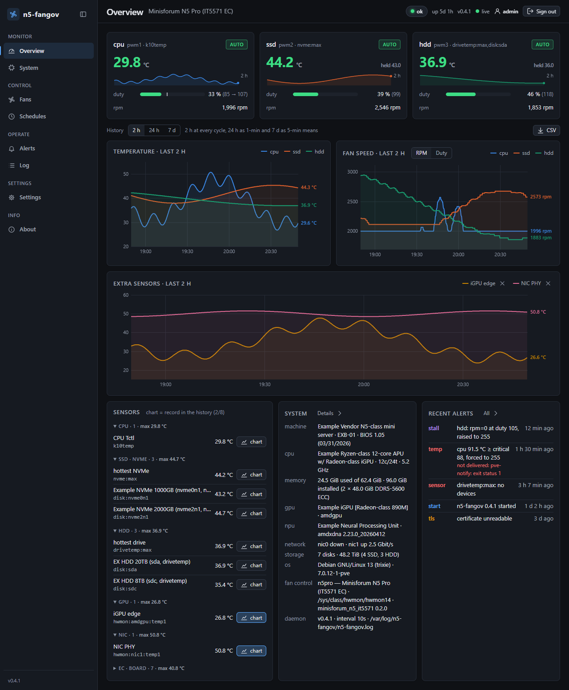

# n5-fangov

Guarded fan control for Proxmox VE and Debian — daemon, CLI and web dashboard in one
static binary. Hardware-verified on the Minisforum N5 Pro.

## What it does

- Takes over the PWM channels a hwmon driver exposes and regulates them from
  multi-sensor curves — the hottest of four drives for the HDD fan, the hottest of
  three NVMe for the SSD fan; `fancontrol` cannot do that.
- Guards every failure it can see: critical temperature, fan stall, sensor loss, write
  errors, its own crash, a kernel update without the driver.
- Curve post-processing per channel — hysteresis and a minimum on-time — so a drive
  fan stops oscillating around a curve point; several sensors per channel (maximum);
  per-disk sensors (`disk:sda`, `disk:nvme1n1`).
- Alerts through the Proxmox notification stack (`PVE::Notify`), `mail(1)`, a
  webhook (ntfy, Gotify, Home Assistant) or the journal — testable from the dashboard.
- Preset schedules by time of day (`[[schedule]]`), with an alert when a switch fails.
- Web dashboard — Overview, System, Fans (curve editor, manual override switch, preset
  editor), Schedules, Alerts, Log, Settings, About — with history over 2 h / 24 h / 7 d
  and CSV export; HTTPS and login on the LAN, plain and open on loopback.
- API tokens with scopes (`read` / `control` / `admin`), expiry and revocation for
  scripts and Home Assistant; OpenAPI document at `/api/openapi.json`.
- Runs sandboxed under systemd with watchdog and failsafe on exit; one binary, one
  dependency, no frontend framework.

## Install in three steps

1. **Driver.** N5 Pro: install the DKMS EC module — [Kernel driver](docs/02-kernel-driver.md).
   Other boards: `nct6775` / `it87` from the distribution kernel.
2. **Binary.** Download the release binary and run the installer — [Install](docs/01-install.md).
3. **Setup.** `n5-fangov setup`, then `systemctl enable --now n5-fangov` — [Setup](docs/03-setup.md).

## What it guards against

Controller hang (systemd watchdog → failsafe → restart) · crash or kill (`ExecStopPost`
puts the fans into the safe state) · kernel update without the DKMS module (apt hook
and start check, fans stay in EC/BIOS mode) · unreadable, frozen or absent sensor ·
stalled fan · failed write · foreign writes to `/sys` · broken config · critical
temperature · vanished fan controller. The full table with the daemon's response to
each: [Alerts and guards](docs/07-alerts.md#what-the-daemon-guards-against).

## Tested hardware

| Platform | Status |
|---|---|
| Minisforum N5 Pro, BIOS 1.05 — Proxmox VE 9.2.20 on Debian 13.7 (trixie), kernel **7.0.14-17-pve** (running) and 7.0.12-1-pve (fallback), DKMS driver `minisforum-n5-it5571` 0.2.0, lm-sensors 3.6.2; binary built with Go 1.26 (static, `golang:1.26-alpine`) | **verified** 2026-09-19 with the 0.4.0 release gate (channel mapping, stop behaviour, load tests, multi-hour runs, reboot); every release is verified on this box before it drops its `-rc` |
| Debian/Ubuntu with NCT67xx (`nct6775`) or IT87xx (`it87`) | from documentation, untested — please report |
| Any Linux with hwmon, no PWM | monitoring only |
| Unraid, TrueNAS, non-systemd | binary runs; the guard chain relies on systemd |

This is a one-person project. The tested column is what was measured on one machine on
the date given; other boards, kernels and driver versions may behave differently, and
mistakes in the documentation or the code are possible despite the release gate. Read
the guard chain before trusting the daemon with hardware you care about, keep the
fans' BIOS defaults reachable (failsafe, `uninstall.sh`), and report what you find as an
issue — security findings through the repository's private vulnerability reporting.
The licence's warranty disclaimer ([LICENSE](LICENSE), GPL-2.0-only §11–12) applies.

## Documentation

| | |
|---|---|
| [Install](docs/01-install.md) · [Kernel driver](docs/02-kernel-driver.md) · [Setup](docs/03-setup.md) | getting it on the box |
| [Dashboard](docs/04-dashboard.md) · [CLI reference](docs/05-cli.md) · [Configuration](docs/06-configuration.md) | using it |
| [Alerts and guards](docs/07-alerts.md) · [HTTPS and security](docs/08-https-security.md) | failure handling, access |
| [API and integrations](docs/12-api.md) | tokens, OpenAPI, the Home Assistant recipe |
| [Updates](docs/09-updates.md) · [Troubleshooting](docs/10-troubleshooting.md) | keeping it running |
| [Development](docs/11-development.md) · [DESIGN.md](DESIGN.md) | building, testing, the contract |

Index of all pages: [docs/README.md](docs/README.md).

## Status

Current release: **0.4.1** (2026-09-19) — safety: hard per-sensor-kind ceilings, an
optional emergency hook (a root-owned file, never an API value), two hardening fixes;
verified through the update re-test on the reference host. 0.4.0 (same day) was the
dashboard redesign and the first public release; the repository is public since then.
A pre-release build shows its suffix in `n5-fangov version` and as a badge in the
dashboard. Changes per version: [CHANGELOG.md](CHANGELOG.md).
Validation data, the measurement scripts and the Bash predecessor `n5-fand` live in
[`minisforum-n5pro-fan-proxmox`](https://github.com/SirRenix/minisforum-n5pro-fan-proxmox);
the EC driver is [`ltdstudio/minisforum-n5-it5571`](https://github.com/ltdstudio/minisforum-n5-it5571).

[Security policy](SECURITY.md) · [Contributing](CONTRIBUTING.md) · [License: GPL-2.0-only](LICENSE)
