# Dashboard

What this page covers: every part of the web UI — header, tabs, history ranges and
CSV, schedules, settings gear, lock, account and API tokens — with a screenshot each. The screenshots come from the built-in mock
(example values, `n5host`, `192.0.2.x`); the complete set is listed in
[screenshots/README.md](screenshots/README.md).

- [Reaching it](#reaching-it)
- [Header and tab bar](#header-and-tab-bar)
- [Overview](#overview)
- [Curves](#curves)
- [Manual](#manual)
- [Presets](#presets)
- [Alerts](#alerts)
- [System](#system)
- [Log](#log)
- [Compatibility and About](#compatibility-and-about)
- [Settings gear](#settings-gear)
- [Account](#account)
- [API tokens](#api-tokens)
- [Lock and certificate panel](#lock-and-certificate-panel)
- [Extra sensors](#extra-sensors)
- [On a phone](#on-a-phone)

## Reaching it

`http://127.0.0.1:8010` (scope `local`) or `https://n5host:8010` (`lan`), as chosen in
[Setup](03-setup.md). With `auth = "basic"` the page has two faces: an anonymous visitor
gets the reduced Overview and the About tab, everything else appears after *Sign in*.
The server enforces this, the UI only mirrors it — the full table is in
[Who sees what](08-https-security.md#who-sees-what).

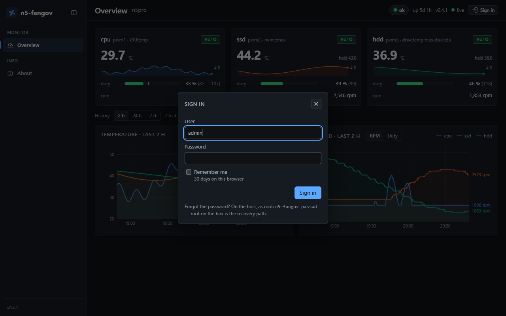

## Header and tab bar

Brand, profile title and the *verified on hardware* badge on the left; on the right the
daemon status chip (`ok`, `sensor-error`, `write-error`, `dry-run`), uptime, the version
with a `beta` badge on pre-releases, the lock (transport and certificate), `live`/`paused`
(paused while the tab is hidden), the signed-in user, *Sign in* or *Sign out*, and the
settings gear. Below it the tab bar — what a tab needs and cannot get answers `401` on
the server, so the tabs that need a login are hidden until you have one.

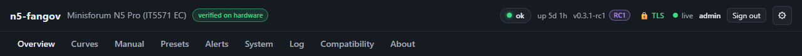

A banner *Connection to the daemon lost* appears after two failed polls; the fans stay
on the daemon side (failsafe on exit), see [Troubleshooting](10-troubleshooting.md).
Toasts (the small confirmations at the corner) show at most three at a time; a fourth
drops the oldest.

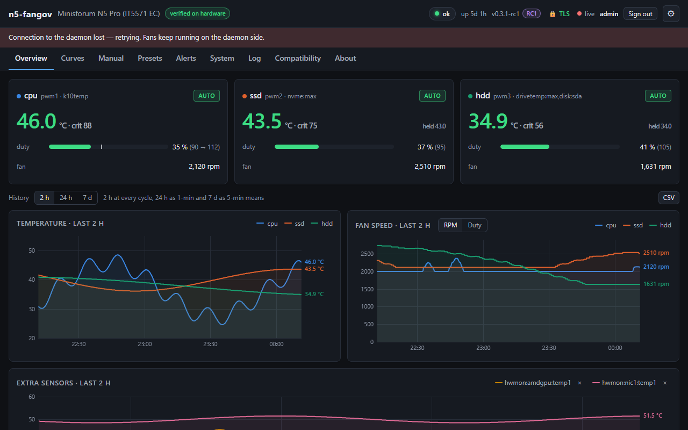

## Overview

The landing page. Anonymous visitors see the channel cards — temperature coloured
relative to the channel's critical value, the duty bar with the target marker (the slew
is still moving there), the mode badge (`AUTO`, `MANUAL`, `CRITICAL`, `STALL`,
`SENSOR-ERROR`, `FAILSAFE`), RPM (`no tach` on a channel without a tachometer, such as
pwm4 on the N5 Pro) — and the two charts (temperature; fan speed with an RPM/duty
toggle). A channel with [hysteresis](06-configuration.md#hysteresis-and-minimum-on-time)
shows the *held* temperature next to the reading when the two differ; a running
minimum on-time shows a `hold` badge with the remaining time.

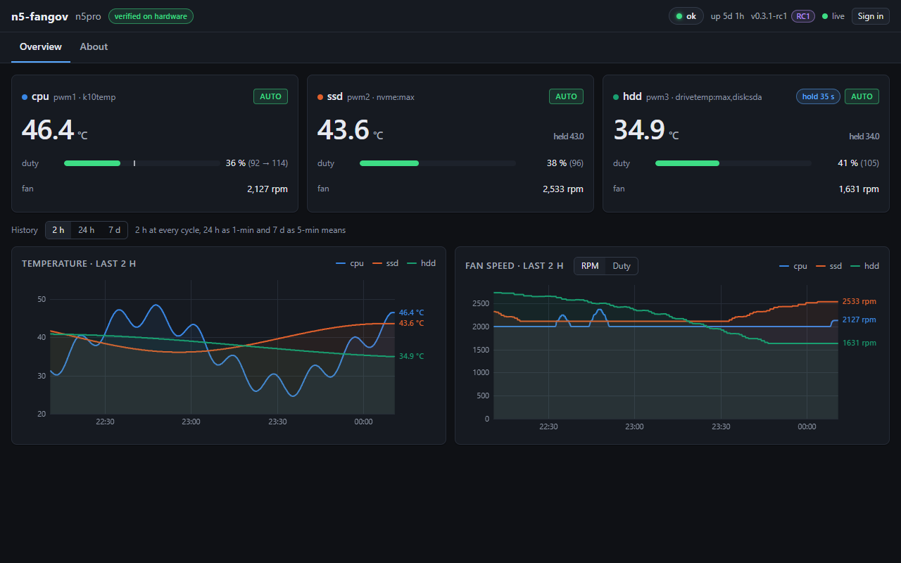

The **range selector** above the charts switches between `2 h`, `24 h` and `7 d`
(remembered in this browser). The 2 h view is one point per regulation cycle and
polls every 30 s; 24 h and 7 d show one-minute and five-minute means and reload every
60 s; the x-axis shows `HH:MM`, `Www HH:MM` or `dd.mm HH:MM` accordingly. The
history survives restarts (`/var/lib/n5-fangov/history.json`, saved every 10 minutes
and at stop — a crash can lose up to 10 minutes). Signed in, *CSV* downloads the
selected range as `n5-fangov-history-<host>-<YYYYMMDD-HHMMSS>.csv`, the timestamp in
the host's local time (from 0.3.1-rc2)
([History and CSV](12-api.md#history-and-csv)).

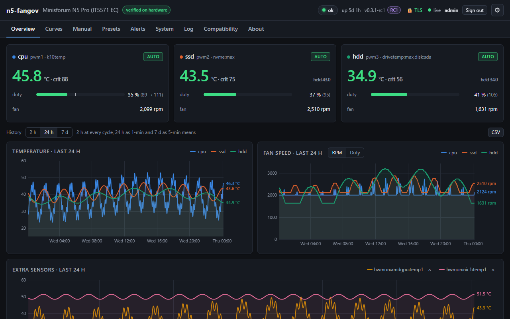

Signed in, the page adds the *Sensors* card (every readable temperature grouped
CPU / SSD·NVMe / HDD / GPU / NIC / EC·board / other, each with a *chart* toggle, see
[Extra sensors](#extra-sensors)) — per-disk ids `disk:sda`, `disk:nvme0n1` are sorted
into SSD·NVMe or HDD by what the kernel reports —, the *Extra sensors* chart once
something is toggled, the *System* card (the short form of the [System](#system) tab)
and *Recent alerts*.

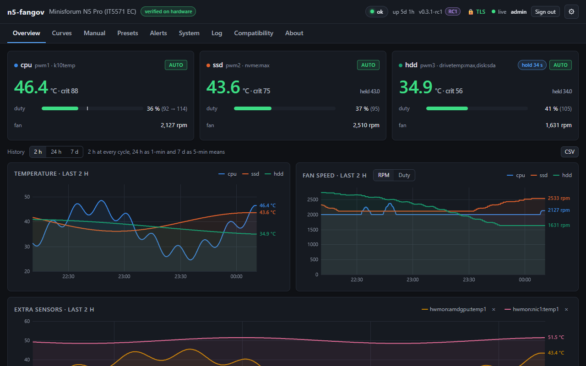
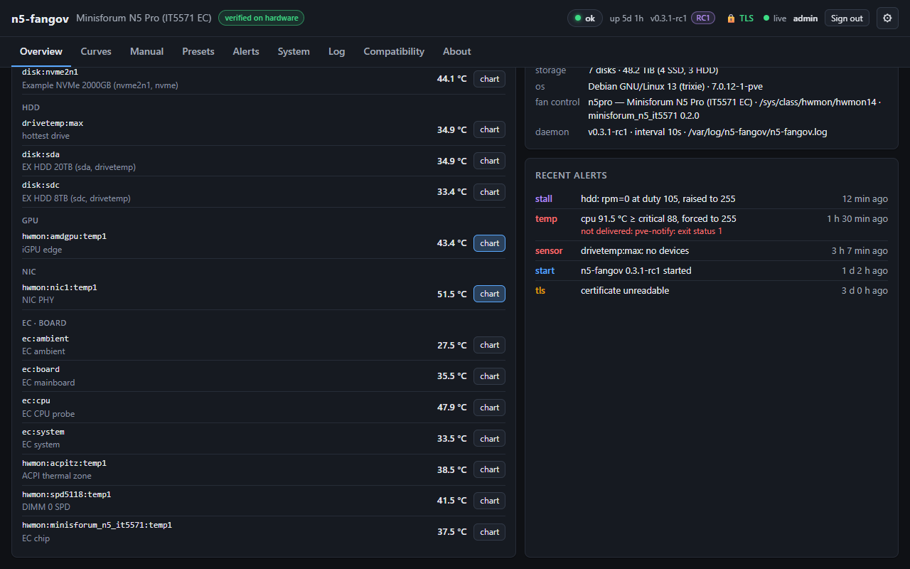

## Curves

One editor per channel. Terms used everywhere in the UI:

- **duty** — the PWM value 0..255 the daemon writes; the bar shows it as a percentage.
- **critical** — the temperature at which the channel goes to 255 at once, also under a
  manual override.
- **stop** — what the channel gets when the daemon stops: `auto` hands it back to the
  chip's own regulation, a number is a fixed duty (never below 60; the N5 Pro HDD
  channel is always fixed, because the EC no longer regulates it after a write — see
  [Kernel driver](02-kernel-driver.md#why-an-out-of-tree-module)).
- **stall** — the guard that raises a channel to 255 when the fan reports 0 RPM at a
  duty that should turn it.
- **hysteresis** (0..10 °C) and **min on** (`off · 30 s · 1 min · 2 min · 5 min · 10 min
  · 30 min · 1 h`) — the curve post-processing per channel: the curve steps only when
  the reading has moved by that many degrees, and a step-up is held for at least that
  long ([Hysteresis and minimum on-time](06-configuration.md#hysteresis-and-minimum-on-time)).

The **sensor** select lists the catalogue's ids; a channel configured with several
sensors (the maximum of them) appears as one option `a,b (max of 2)` so the editor
never drops it — the array form itself is edited in the config file
([Sensor ids](06-configuration.md#sensor-ids)).

Drag the points on the canvas or edit the table; *+ add point* inserts a point at the
middle of the widest temperature gap and keeps the table sorted; editing a temperature
re-sorts the rows when the field loses focus. A point can also be moved with the
**keyboard**: tab to it and use the arrow keys (1 °C / 5 duty per step, ×5 with Shift).
The dashed line is `crit`, the dotted one the live reading (`now`), and on the N5 Pro
the measured duty→RPM pairs sit under the table.

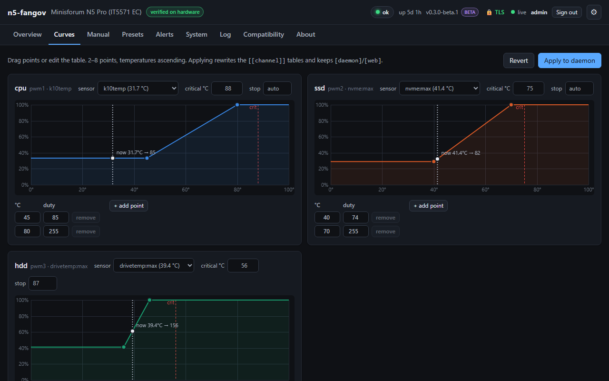
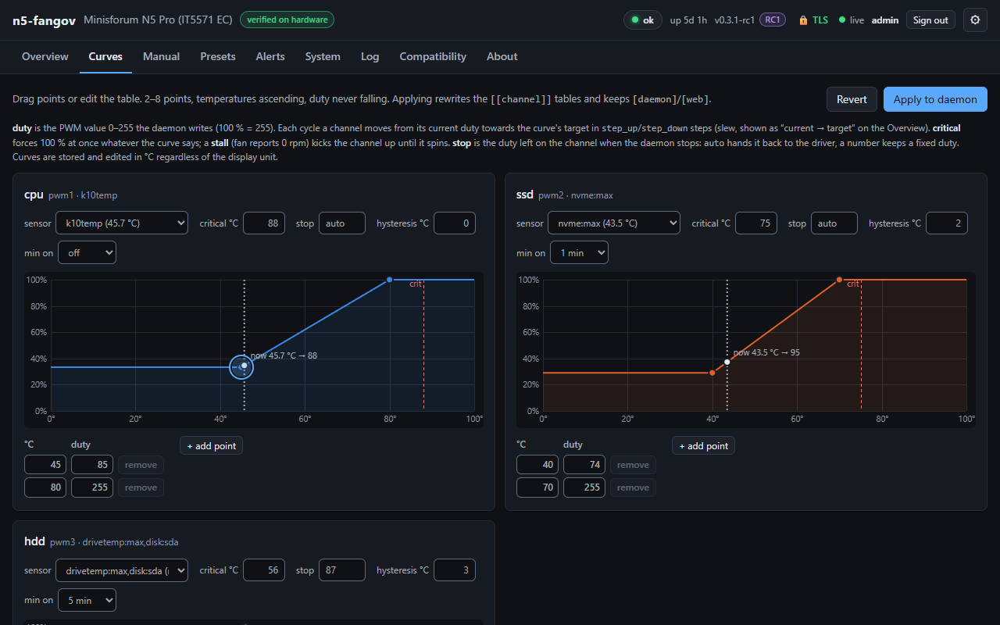

The editor refuses what the daemon would replace by a default — 2..8 points,
temperatures ascending, duties not descending, critical above the last point, stop
`auto` or 60..255, hysteresis 0..10 ([curve rules](06-configuration.md#curve-rules)) —
before it sends anything. *Apply to daemon* rewrites the `[[channel]]` tables of the
config file (sensor, curve, critical, stop, and hysteresis/min_on when set) and
reloads without a restart, *Revert* reloads the daemon's curves. A changed channel set
answers *restart required* (the notice tells you the command). Unsaved edits are marked;
the editor keeps them across a session expiry until you sign in again.

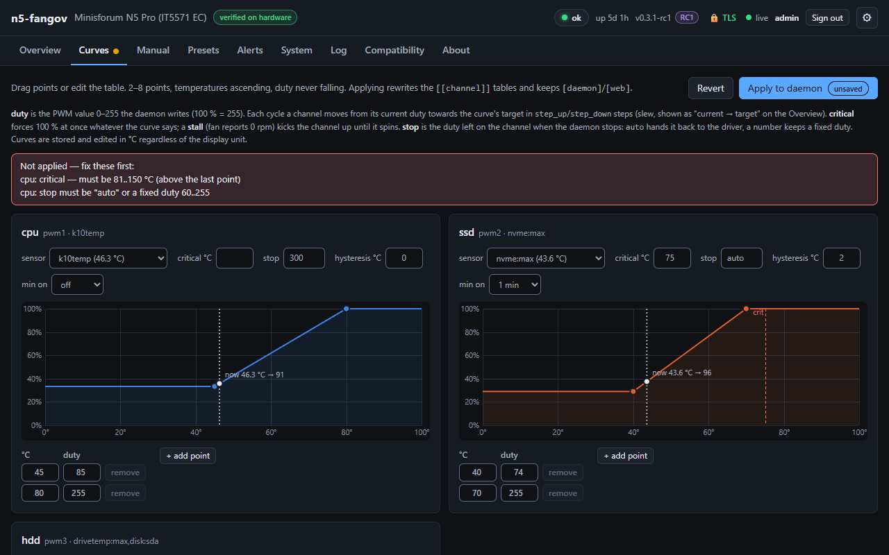
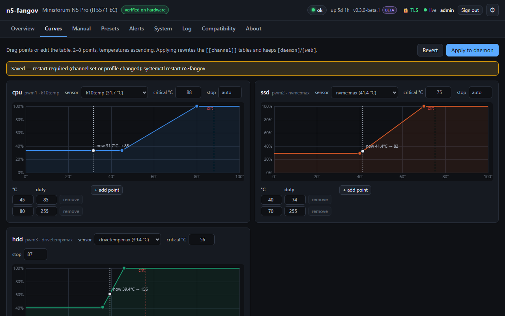

## Manual

Holds a fixed duty per channel until *Back to auto*; critical and stall still apply on
top. The slider starts at the channel's **current** duty (what the curve is writing
right now), and *Set* applies the value the slider shows — moving the slider alone
changes nothing, and there is no separate on/off switch: *Set* puts the channel into
`MANUAL`, *Back to auto* returns it to the curve (an explicit per-channel toggle is on
the 0.4.0 list). HDD-like channels (fixed stop, N5 Pro pwm3) refuse values below 60 — the
EC stops regulating them after the first write and a low manual duty would be permanent
for disks whose temperature reacts minutes later. The same from the shell:
`n5-fangov set` / `auto` ([CLI](05-cli.md)).

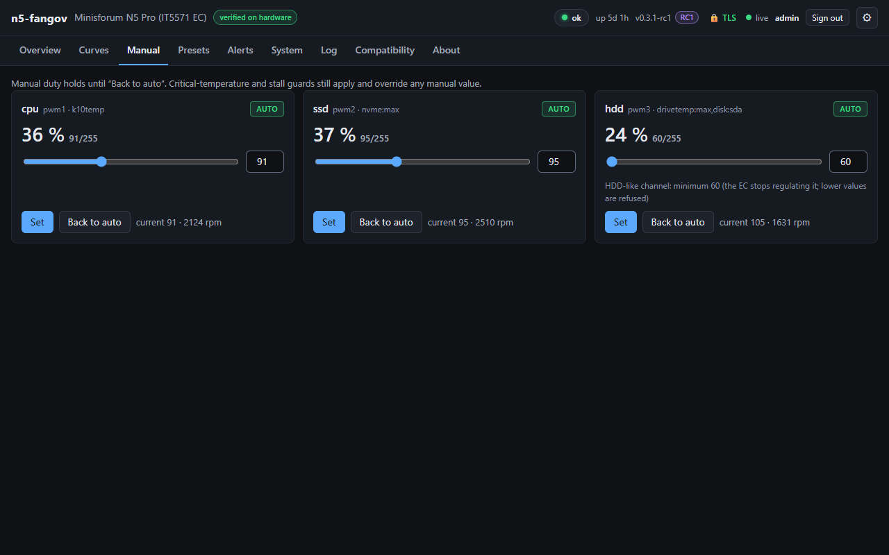

## Presets

Lists the built-in N5 Pro sets (badge *built-in*, the recommended one marked) and your
own files from `/etc/n5-fangov/presets/`. *Apply* merges the preset into the config
file by pwm — channels the preset does not name (an optional pwm4) stay — and reloads;
*Details* shows the preset's channel tables (sensor, curve points, critical, stop,
hysteresis, min on); *Rename* and *Delete* work on user presets only; *Save current
as…* stores the curves the daemon runs now (not the unsaved editor state) — so the new
preset shows as active at once, it *is* the running set. To compose a set with other
values, edit the curves first (Curves tab, *Apply to daemon*) and then save, or write
the preset file by hand ([Presets](06-configuration.md#presets)); a preset editor is on
the 0.4.0 list. The values of the three built-in sets, the file format and the merge
rule: [Presets](06-configuration.md#presets).

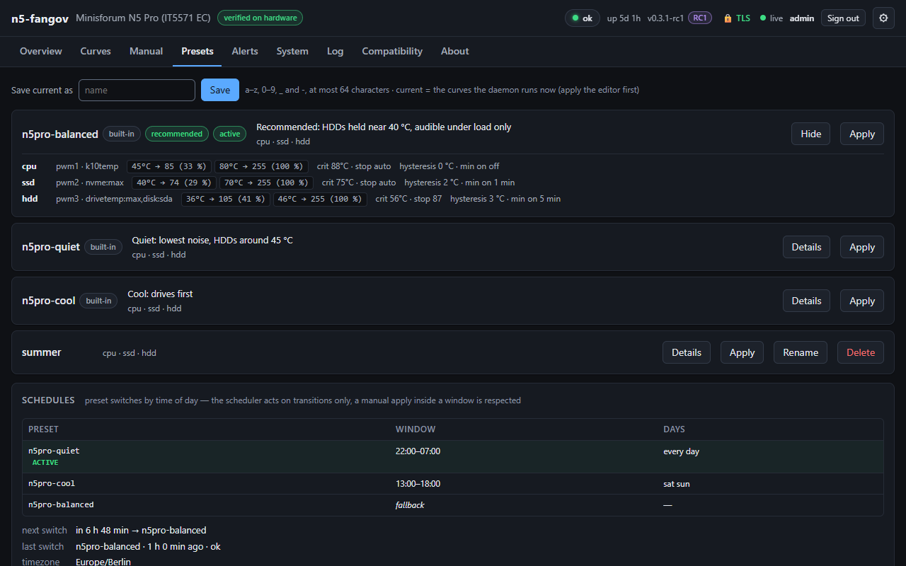

The **Schedules** card below the presets is read-only: one row per `[[schedule]]`
entry (preset, window or *fallback*, days, an ACTIVE badge on the entry in effect),
the next switch, the last switch — with its error as a warning when it failed — and
the timezone the host's clock uses. The list is edited in the config file
([Schedules](06-configuration.md#schedules)), an editable card is on the 0.4.0 list;
the card refreshes every 60 s while the tab is open.

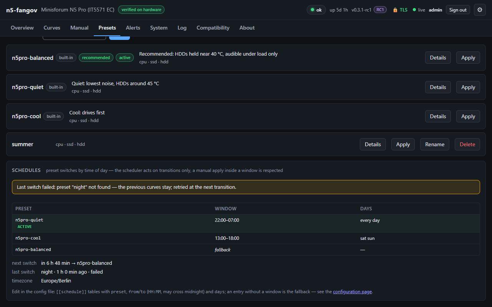

## Alerts

Shows the configured and the effective transport, which tools the box has, the PVE
template state with *Install / Update template*, the cooldown, every alert kind with its
last delivery and the recent alerts; *Send test alert* goes through the real transport
and reports a delivery error. The transport form shows `mail_to` for `auto`/`mail` and
the URL plus format (`json`/`text`) for `webhook`; *Save* applies without a restart.
What each button does, the webhook payload and the PVE side: [Alerts](07-alerts.md).

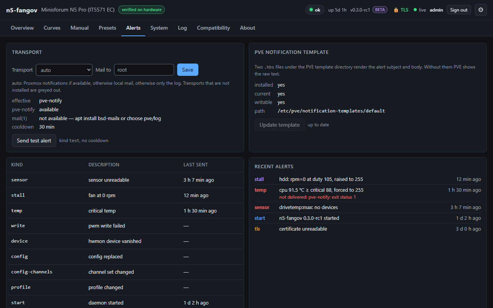
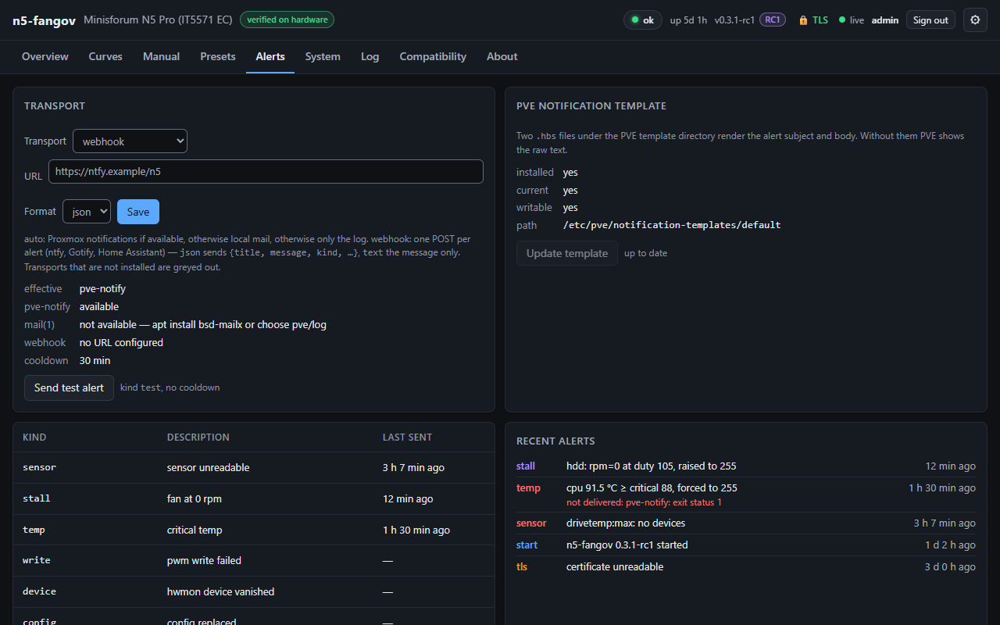
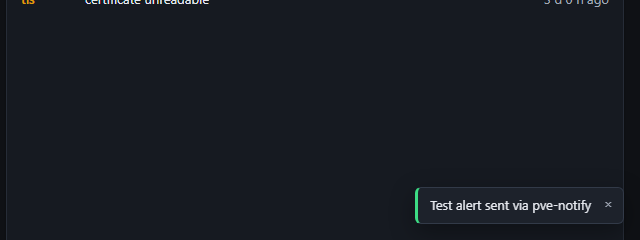

## System

The hardware inventory in full: host, machine/board/BIOS, CPU (model, cores/threads, top
clock), fan controller (profile, hwmon path, driver module), memory with the installed
modules, GPU · NPU (with driver version), network (physical NICs, link state, MACs, MTU),
storage — every disk with its **live temperature** (the same reading the `disk:<dev>`
sensor uses; empty for a device without a hwmon) and a sum row —, load and uptime. The signed-in Overview carries the same as a card at a glance;
`n5-fangov system` prints it from the shell (`--json` for the document; without a
running daemon it collects locally). `GET /api/system` is protected like every other
endpoint — the inventory names the operator's hardware.

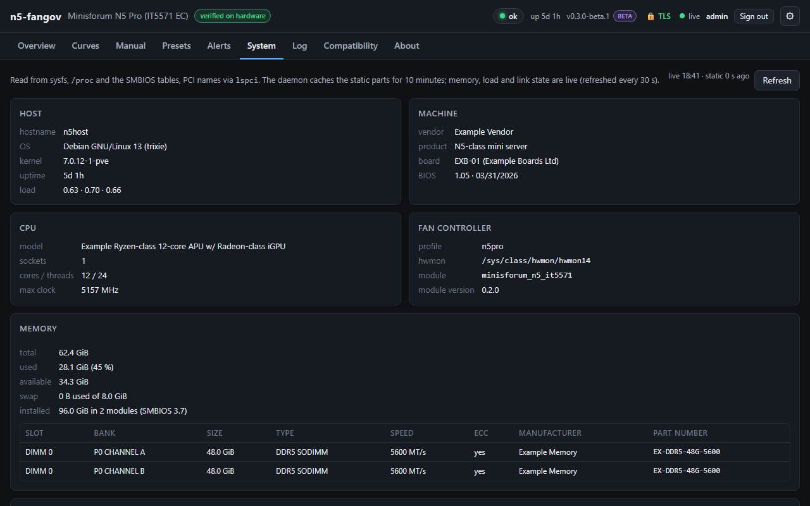
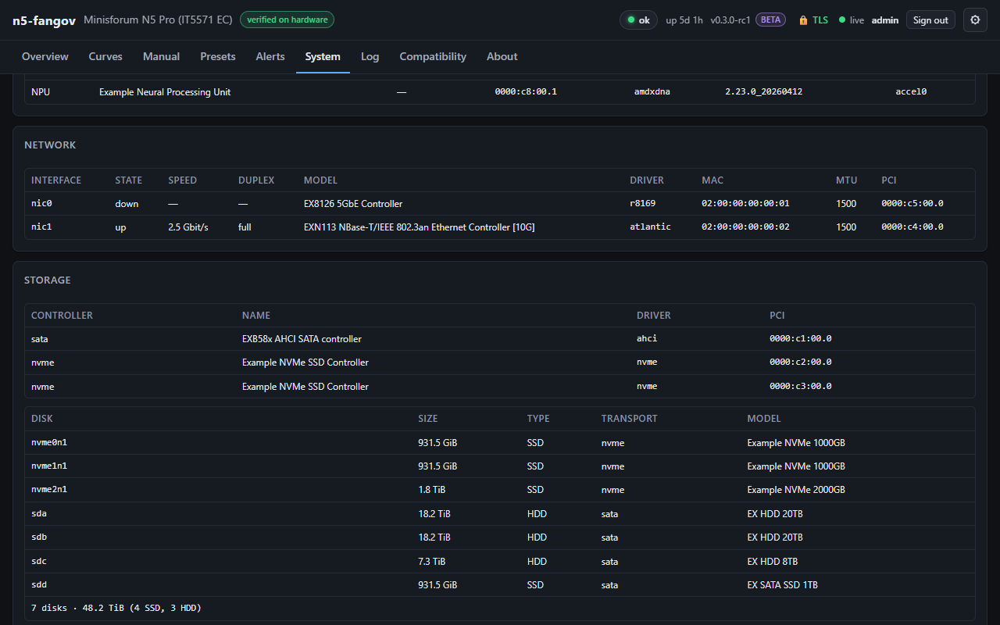

Everything is read from files the daemon can reach inside its sandbox: `/sys/class/dmi/id`
(machine), `/proc/cpuinfo` and cpufreq (CPU), `/proc/meminfo` (memory), `/sys/bus/pci/devices`
with the driver links (GPU, NPU, NICs, storage controllers), `/sys/class/accel` and
`/sys/class/drm`, `/sys/class/net` (interfaces with a device link — bridges, veth, tap and
`lo` are skipped), `/sys/block` (zvols, loop, dm and ram devices skipped; the disk
temperature is `temp1_input` of the device's hwmon), `/sys/module` (driver versions),
`/etc/os-release`, `/proc/uptime`, `/proc/loadavg`. The **memory
modules** (size, type, speed, manufacturer, part number, ECC) come from the SMBIOS
structure table the kernel exports as `/sys/firmware/dmi/tables/DMI` — parsed by the
daemon itself, no `dmidecode` and no `/dev/mem` needed. PCI device **names** need `lspci`
(package `pciutils`, present on Proxmox VE); without it the entries carry
`PCI device <vendor>:<device>` ids and the tab shows a note. The static parts are cached
for 10 minutes, memory usage, load, uptime, NIC link state and the disk temperatures
are read on every request (the tab refreshes every 30 s). No serial numbers are read.

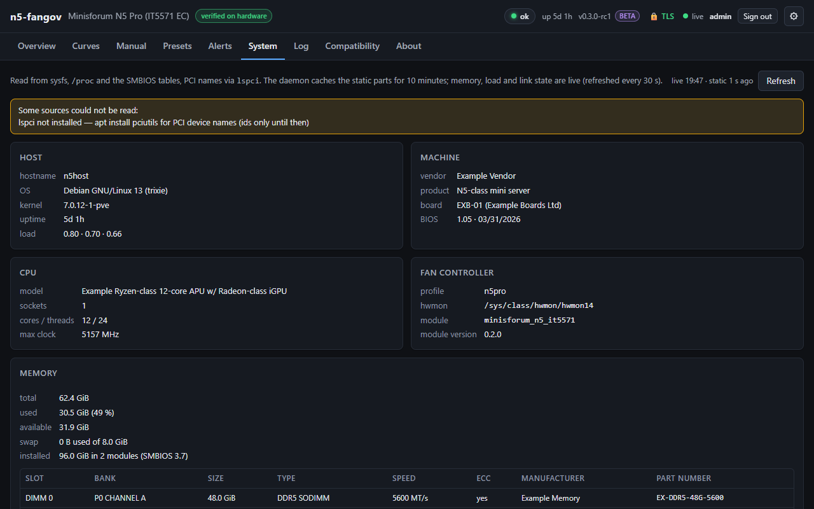

## Log

The daemon's log file (journal when no file is configured) with a text filter,
auto-scroll, *Refresh*, *Export* (whole current file) and *Clear* (with confirmation;
rotated files and the journal stay). File, rotation and the CLI form:
[Logs](10-troubleshooting.md#logs).

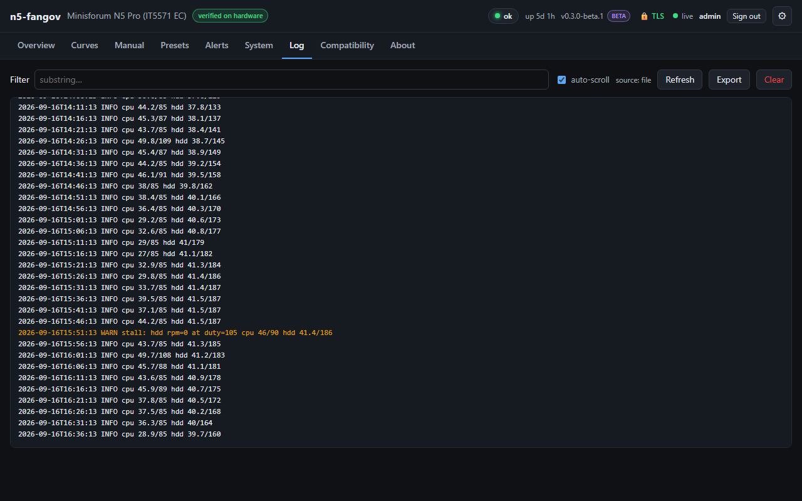

## Compatibility and About

**Compatibility** lists the profiles with the active one and the verified/untested
badges. **About** (public) carries name, version with the pre-release tag, licence,
repository and author links, the Go version the binary was built with, and the credits:
[`ltdstudio/minisforum-n5-it5571`](https://github.com/ltdstudio/minisforum-n5-it5571)
(the kernel driver for the IT5571 EC) and
[`Sl0thC0der/proxfansx`](https://github.com/Sl0thC0der/proxfansx) (the dashboard idea
and the generic NCT67xx/IT87xx handling the `nct67xx`/`it87xx` profiles follow; no code
shared). The releases page linked there is maintained with the release workflow
([Development](11-development.md#release-workflow)).

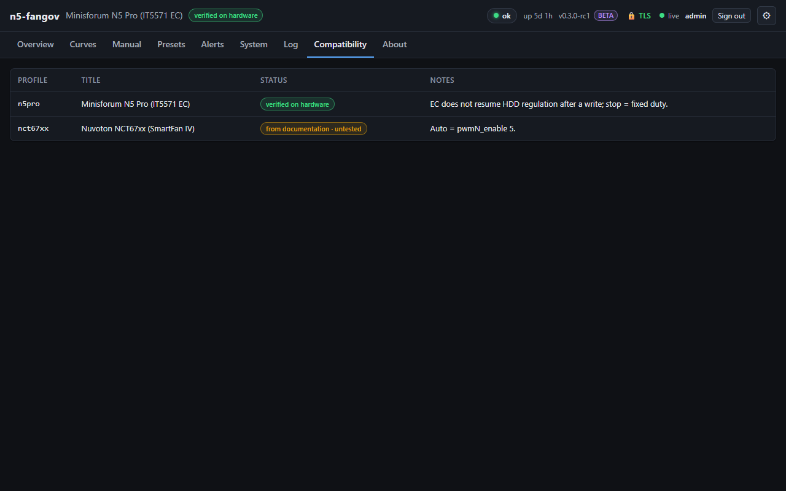
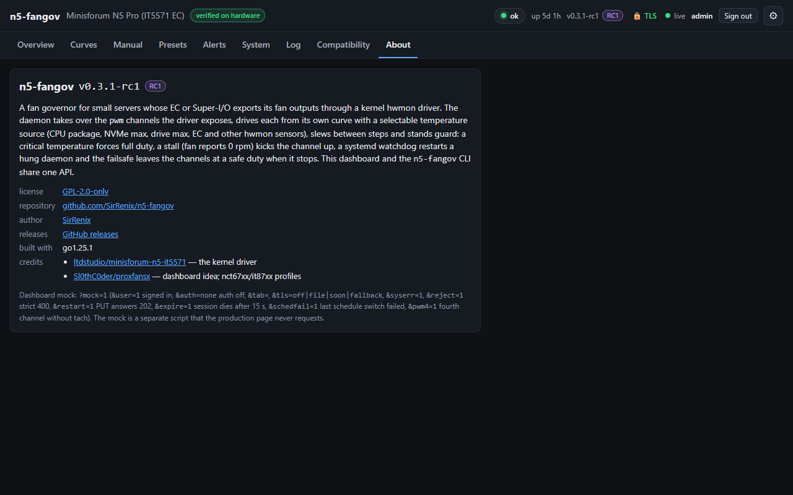

## Settings gear

Signed in: temperature unit °C/°F, refresh interval 5/10/30 s, theme dark/light/system
(stored in this browser), *Export settings* / *Import settings…* (config plus presets as
one JSON, see [Backup and restore](09-updates.md#backup-and-restore)), *Certificate…*
and *Account…*.

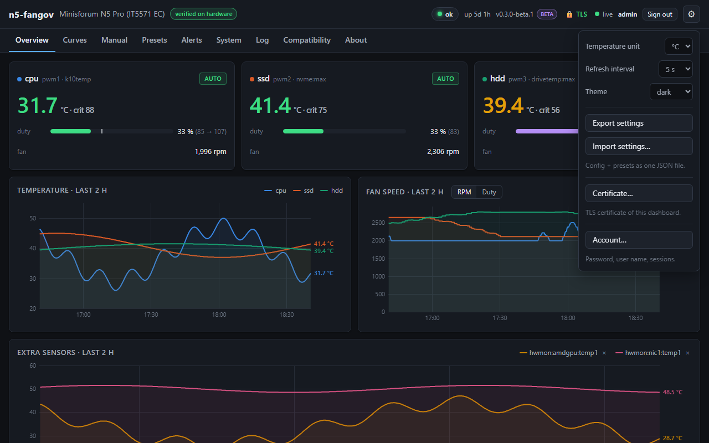
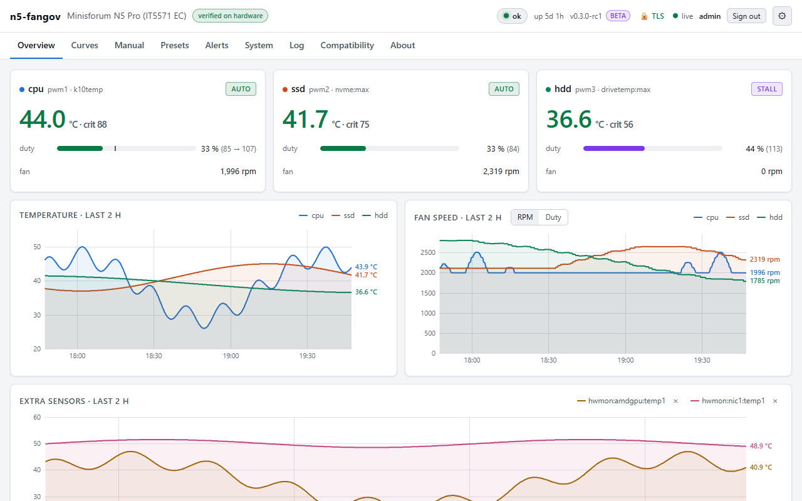

## Account

*Account…* opens the dialog with *Change password…*, *Change user…*, the list of
active sessions (id, created, last seen, expiry, IP, remember) with *Sign out other
sessions* — the current one is marked — and the [API tokens](#api-tokens) section.

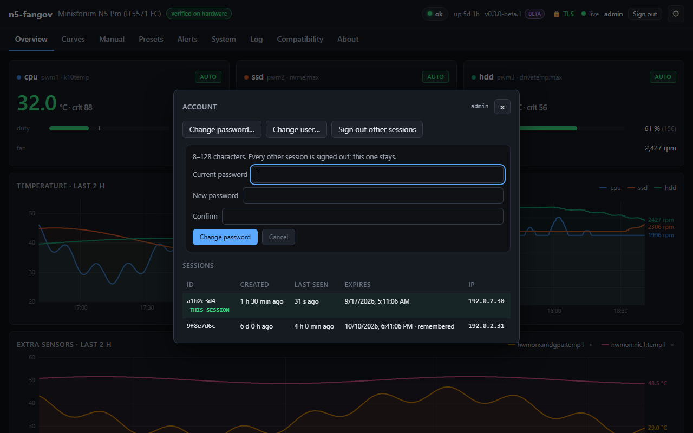

- **Change password… / Change user…** ask for the current password, write the new
  `password_hash` (or `user`) into the config file in place — comments and every other
  key untouched — apply it at once and sign every *other* session out. User names are
  `[A-Za-z0-9_.-]{1,32}`, passwords 8..128 characters. A wrong current password counts as
  a failed login for the [rate limiter](08-https-security.md#login-throttling).
- The in-place edit handles the `[web]` header and the dotted `web.user = …` layout; an
  inline table `web = { … }` is refused with a message (edit the file by hand) — the same
  applies to `[alert]` and `[dashboard]`.
- `n5-fangov passwd` still works from the shell (restart to apply) — for a forgotten
  password, for instance ([Setup](03-setup.md#change-user-or-password-later)).
- With `auth = "none"` every visitor counts as signed in; the account forms answer
  `409 auth is none`.

Session lifetime, persistence and what *Sign out* can and cannot do:
[Sessions](08-https-security.md#sessions).

## API tokens

The *API tokens* section of the Account dialog lists every token — name, scope,
created, expires, last used, last address — with *Revoke* (asks for confirmation).
*Create token…* takes a name, the scope (`read`, `control`, `admin`, each with a
one-line explanation) and the expiry (`30 d · 90 d · 1 y · never`); after creation the
secret is shown **once** in a read-only field with *Copy* and the notice that it will
not be shown again — *never* comes with a warning. A token stands in for the password
in scripts and Home Assistant with just the rights its scope grants; what it can never
do, where it is stored and how it is throttled: [API tokens](08-https-security.md#api-tokens);
using it: [API and integrations](12-api.md). With `auth = "none"` the section is
pointless — everyone is signed in — and a Bearer header is ignored.

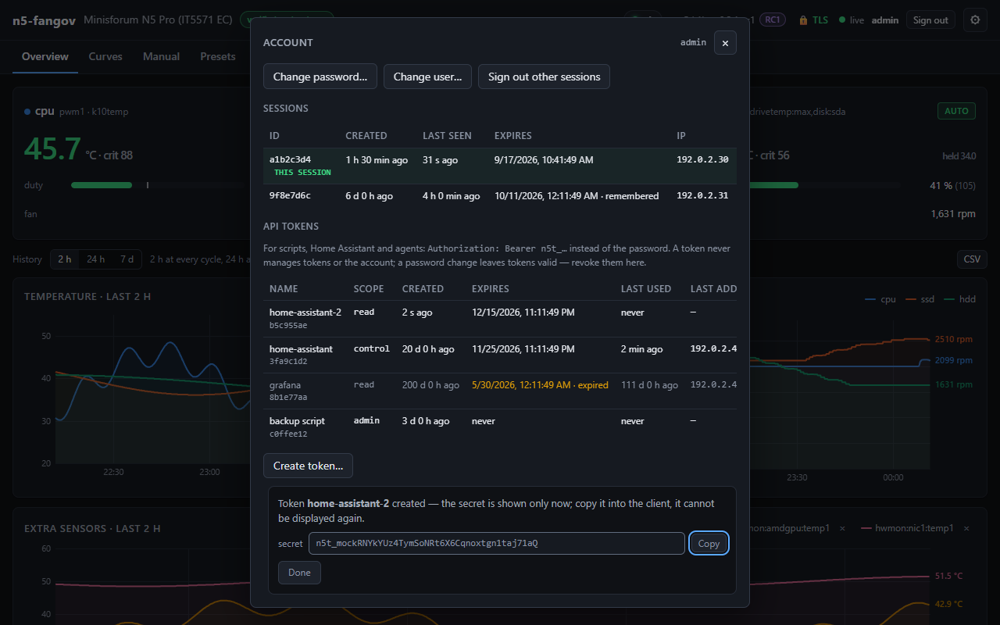

## Lock and certificate panel

`🔒 TLS` or `🔓 HTTP` in the header; the tooltip carries certificate mode and expiry,
the click (or *Settings → Certificate…*) opens the certificate panel: subject, issuer,
SANs, validity, key type, fingerprint with a copy button, download `.crt`/`.cer`,
regenerate, upload your own pair, back to auto, and the *How to trust this certificate*
recipes. What each action does: [HTTPS](08-https-security.md#the-certificate).

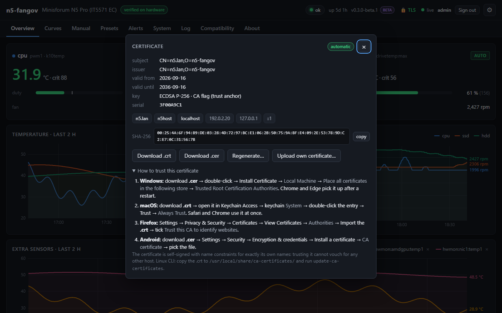
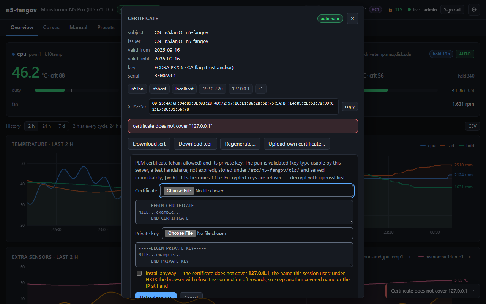
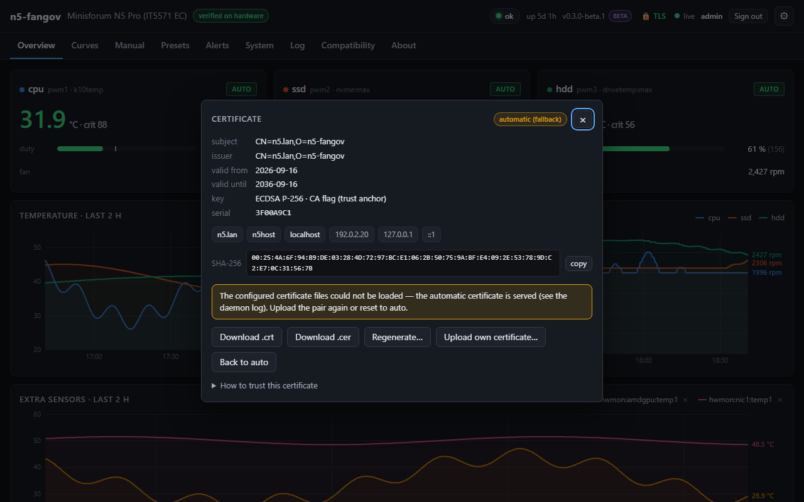
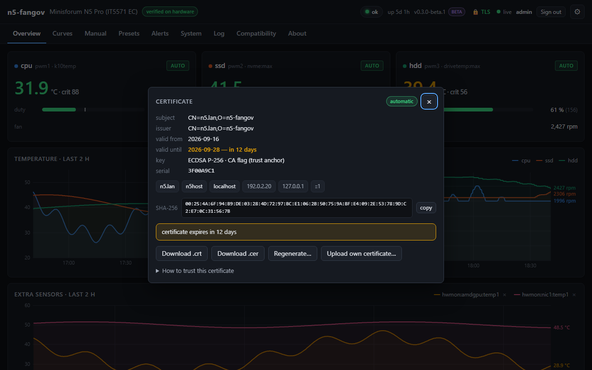
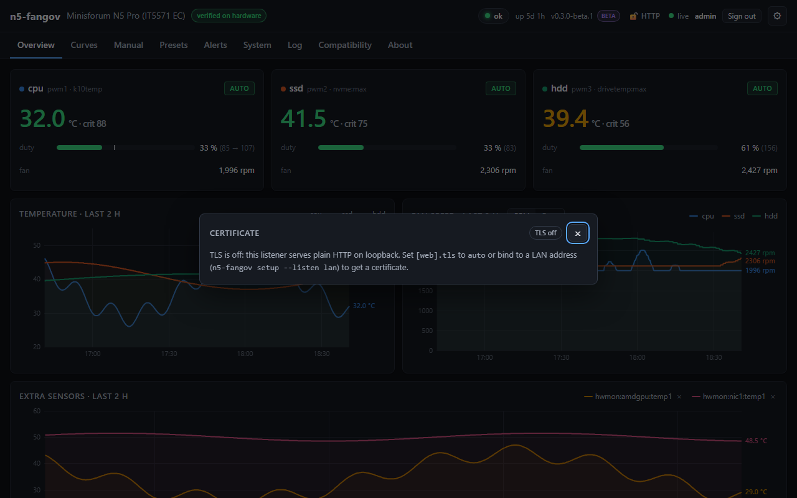

## Extra sensors

The signed-in Overview lists every readable temperature (`GET /api/sensors`, grouped
CPU / SSD·NVMe / HDD / GPU / NIC / EC·board / other; one `disk:<dev>` row per disk with
a hwmon, named by model); the *chart* toggle per row adds or removes the sensor id in
`[dashboard] sensors` (`PUT /api/dashboard`, 0..8 ids, same forms as channel sensors —
[Sensor ids](06-configuration.md#sensor-ids)). Watched sensors
are read once per cycle after the channel sensors, recorded in the history
(`history[].extra`) and drawn in the *Extra sensors* chart card; they never influence
regulation. An id whose device is absent right now is kept with a warning and charted
once it appears; an id that is not a known form is refused. The list applies without a
restart, also when edited in the config file.

## On a phone

The cards stack, the header is one line and the tab bar stays sticky; the curve points
can be dragged by touch.

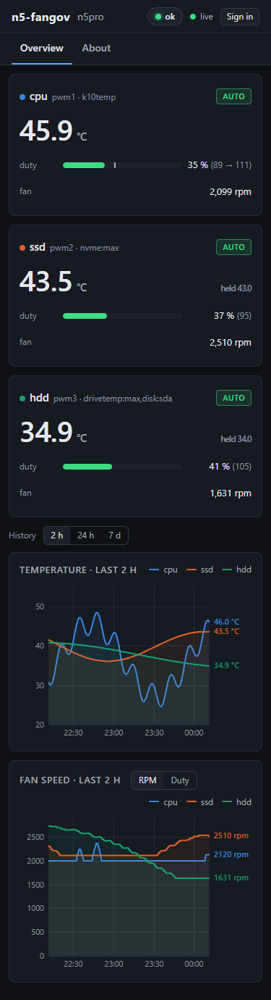
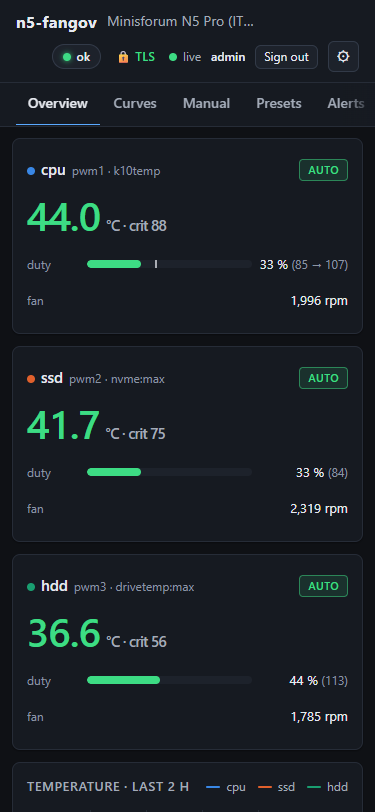
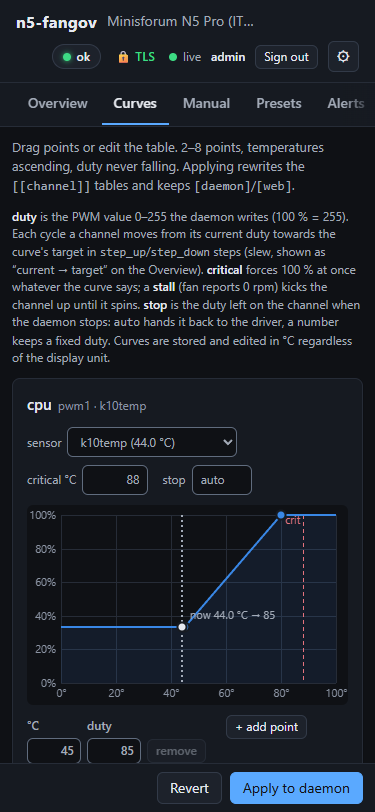

Next: [CLI reference](05-cli.md) · [Configuration](06-configuration.md) ·
[API and integrations](12-api.md) · [HTTPS and security](08-https-security.md)
