# Dashboard

What this page covers: the web UI of 0.4.0 — the shell (sidebar, page header, phone
bottom bar), the anonymous view, every page in navigation order, the dialogs, keyboard
and screen-reader behaviour, theming, deep links, the mock and what happens when the
connection or the session goes. The screenshots come from the built-in mock (example
values, `n5host`, `192.0.2.x`); the complete set is listed in
[screenshots/README.md](screenshots/README.md).

- [Reaching it](#reaching-it)
- [The shell](#the-shell)
- [Overview](#overview)
- [System](#system)
- [Fans](#fans)
- [Schedules](#schedules)
- [Alerts](#alerts)
- [Log](#log)
- [Settings](#settings)
- [About](#about)
- [Dialogs](#dialogs)
- [Keyboard and screen readers](#keyboard-and-screen-readers)
- [Theme and motion](#theme-and-motion)
- [Deep links](#deep-links)
- [The mock](#the-mock)
- [Connection loss and session expiry](#connection-loss-and-session-expiry)
- [On a phone](#on-a-phone)

## Reaching it

`http://127.0.0.1:8010` (scope `local`) or `https://n5host:8010` (`lan`), as chosen in
[Setup](03-setup.md). With `auth = "basic"` the page has two faces: an anonymous visitor
gets the reduced Overview and the About page — the sidebar lists only those two —,
everything else appears after *Sign in*. The server enforces this, the UI only mirrors
it: the full table is in [Who sees what](08-https-security.md#who-sees-what).

*Sign in* in the page header opens the [sign-in dialog](#dialogs). With `auth = "none"`
every visitor counts as signed in; *Sign in*, *Sign out* and the user name are not shown.

## The shell

**Sidebar** (left, 220 px): the brand row — logo, name and, at its right end, the
**sidebar toggle**: the panel-left icon (a rectangle with a divider, the control GitHub,
Linear or VS Code use for the same thing; tooltip *Collapse sidebar · [*) —, then the
pages in five groups — *Monitor* (Overview, System), *Control* (Fans, Schedules),
*Operate* (Alerts, Log), *Settings* (Settings), *Info* (About). The current page is
marked (`aria-current="page"`, accent bar). The toggle switches to the 56 px **icon
rail** (icons with the page name as tooltip) and back; the `[` key does the same
whenever the focus is not in a field or a dialog; the same choice is *Navigation* in
Settings → Display, stored in this browser. In the rail the logo stands alone at the top
and is itself the expand control (click, tooltip, `aria-label`), and the panel icon
appears at the **left edge of the page header** before the title — the place where every
such app expands its sidebar; there is no second button in the rail. Between 700 and
1099 px the rail is forced (the sidebar would leave the header no room): the logo does
not expand and the header icon is disabled with the tooltip *Sidebar collapses below 1100 px*; the stored choice applies
from 1100 px. The footer shows the daemon's version.

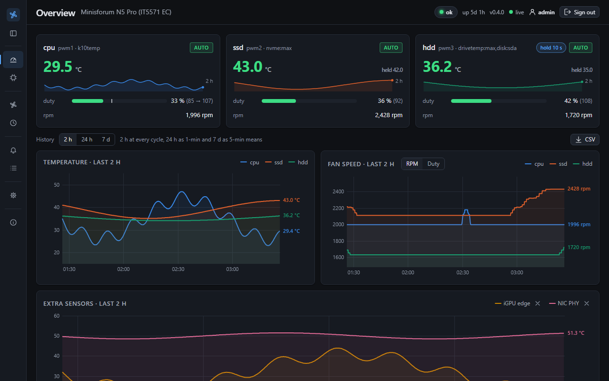

**Page header**: page title and the profile title on the left; on the right the daemon
status chip (`ok`, `sensor-error`, `write-error`, `dry-run`), uptime, the version with a
`beta` badge on a pre-release, the **certificate warning chip** (only while something is
wrong: `plain HTTP` off loopback, `certificate fallback`, `certificate expires in N d`
below 30 days, `certificate expired`; the tooltip carries mode and expiry, the click
leads to Settings → Certificate), `live`/`paused` (paused while the browser tab is
hidden; the dot turns red after two failed polls), the signed-in user and *Sign in* /
*Sign out*. The browser tab reads `<page> · n5-fangov`. Below 1000 px uptime and version
are dropped, below 900 px the certificate chip is icon-only, below 700 px the header is
title, status chip, live dot and user button.

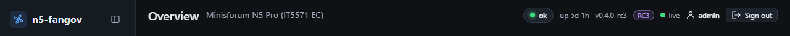
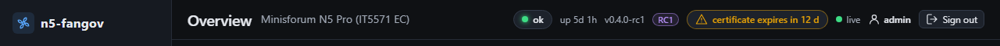

Below the header two banners can appear: *Connection to the daemon lost — retrying* after
two failed polls ([below](#connection-loss-and-session-expiry)) and the restart notice of
a settings import. Toasts (the confirmations at the lower right) show at most three per
live region; a fourth drops the oldest. Errors use the assertive region.

**Phone** (below 700 px): the sidebar is gone, a fixed **bottom bar** carries Overview ·
Fans · Alerts · Settings · *More*; *More* opens a sheet with the remaining pages (System,
Schedules, Log, About) and their group. Anonymous: Overview · More (About).

## Overview

The landing page. **Tiles**, one per channel: name, `pwmN · sensor`, mode badge (`AUTO`,
`MANUAL`, `CRITICAL`, `STALL`, `SENSOR-ERROR`, `FAILSAFE`), the temperature (coloured by
its share of the channel's critical value — neutral for an anonymous visitor, who does
not get the config), `held …` next to it when a [hysteresis](06-configuration.md#hysteresis-and-minimum-on-time)
holds the curve at another value, a `hold` badge with the remaining minimum on-time, a
**sparkline** of the last 2 h (whatever range the charts show), the duty bar with the
target marker while the slew is moving — `33 % (85 → 107)` — and the RPM (`no tach` on
a channel without tachometer such as pwm4 on the N5 Pro, `0 rpm` in red).

The **History** bar: range switch `2 h · 24 h · 7 d` (remembered in this browser) and,
signed in, *CSV*. 2 h is one point per regulation cycle, polled every 30 s; 24 h and 7 d
are one-minute and five-minute means reloaded every 60 s; the x-axis reads `HH:MM`,
`Www HH:MM` or `dd.mm HH:MM`. The history survives restarts
(`/var/lib/n5-fangov/history.json`, saved every 10 minutes and at stop). *CSV* downloads
the selected range as `n5-fangov-history-<host>-<YYYYMMDD-HHMMSS>.csv`, timestamp in the
host's local time ([History and CSV](12-api.md#history-and-csv)).

**Charts**: *Temperature*, *Fan speed* (`RPM` / `Duty` switch; RPM autoscales, duty keeps
0..255) and, signed in and once a sensor is watched, *Extra sensors* — the same chart
for the ids in `[dashboard] sensors`, legend entries with a *remove* ×. Hover for the
values at a time; the legend names come from the sensor catalogue.

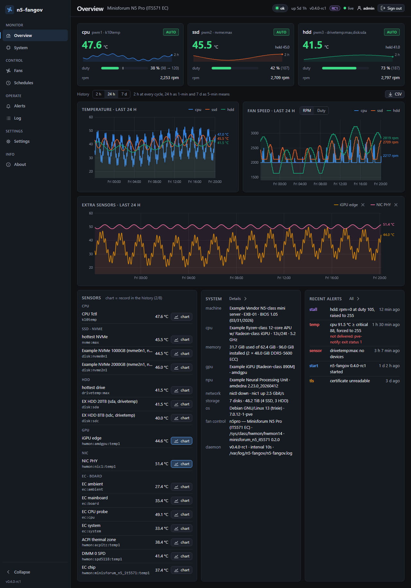

Signed in, three cards follow:

- **Sensors** — every readable temperature (`GET /api/sensors`) grouped CPU / SSD · NVMe
  / HDD / GPU / NIC / EC · board / other, each group a collapsible block whose heading
  reads `EC · board · 7 · max 35.4 °C` (name, count, the live maximum of the group).
  A group starts open when it holds a channel's sensor (the parts of a composite id
  included) or a charted one, closed otherwise; a group you open or close stays that
  way in this browser. Inside: a `disk:<dev>` row per disk with a hwmon, sorted
  into SSD · NVMe or HDD by what the kernel reports; description, id, live value and the
  *chart* toggle (`aria-pressed`). *chart* adds or removes the id in `[dashboard] sensors`
  (`PUT /api/dashboard`, at most 8 — the hint counts `n/8`, further toggles are disabled
  with a reason). Watched sensors are read once per cycle after the channel sensors,
  recorded in the history (`history[].extra`) and drawn in *Extra sensors*; they never
  influence regulation. An id whose device is absent right now is kept with a warning
  and charted once it appears. The list applies without a restart, also when edited in
  the config file ([Sensor ids](06-configuration.md#sensor-ids)).
- **System** — the inventory at a glance (machine, CPU, memory, GPU, NPU, network,
  storage, OS, fan controller, daemon), refreshed every 30 s; *Details* opens the
  [System](#system) page.
- **Recent alerts** — kind, message, `not delivered: …` when the transport failed, and
  the time; *All* opens the [Alerts](#alerts) page.

The page polls `/api/state` every 5 s (Settings → Display: 5, 10 or 30 s), the history per
range, alerts every 60 s and the system glance every 30 s; nothing is polled while the
browser tab is hidden.

## System

The hardware inventory in full: host (hostname, OS, kernel, uptime, load), machine
(vendor, product, board, BIOS), CPU (model, sockets, cores/threads, max clock), fan
controller (profile, hwmon path, module, module version), memory (total, used, available,
swap, installed) with the module table (slot, bank, size, type, speed, ECC, manufacturer,
part number), GPU · NPU (with driver and driver version), network (physical NICs with
state, speed, duplex, model, driver, MAC, MTU, PCI address), storage (controllers; disks
with size, type, transport, model and the **live temperature** — the reading the
`disk:<dev>` sensor uses, `—` without a hwmon — and a sum row). `live HH:MM · static N
ago` says when the live parts were read and how old the cached static parts are;
*Refresh* re-reads. `n5-fangov system` prints the same from the shell (`--json`; without
a running daemon it collects locally). `GET /api/system` is protected like every other
endpoint — the inventory names the operator's hardware.

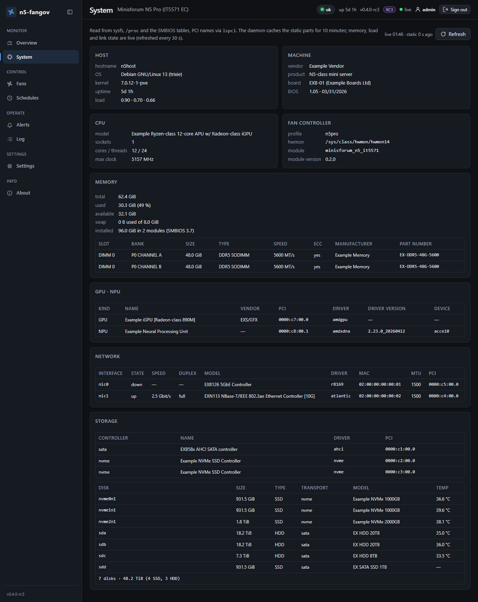

Everything is read from files the daemon can reach inside its sandbox: `/sys/class/dmi/id`
(machine), `/proc/cpuinfo` and cpufreq (CPU), `/proc/meminfo` (memory), `/sys/bus/pci/devices`
with the driver links (GPU, NPU, NICs, storage controllers), `/sys/class/accel` and
`/sys/class/drm`, `/sys/class/net` (interfaces with a device link — bridges, veth, tap and
`lo` are skipped), `/sys/block` (zvols, loop, dm and ram devices skipped; the disk
temperature is `temp1_input` of the device's hwmon), `/sys/module` (driver versions),
`/etc/os-release`, `/proc/uptime`, `/proc/loadavg`. The **memory modules** come from the
SMBIOS table the kernel exports as `/sys/firmware/dmi/tables/DMI` — parsed by the daemon,
no `dmidecode`, no `/dev/mem`. PCI device **names** need `lspci` (package `pciutils`,
present on Proxmox VE); without it the entries carry `PCI device <vendor>:<device>` ids
and a notice says so. Static parts are cached for 10 minutes; memory usage, load, uptime,
NIC link state and the disk temperatures are read on every request (the page refreshes
every 30 s). No serial numbers are read.

## Fans

Curves, manual override and presets on one page: a **card per channel**, the **Presets**
row below, a **sticky action bar** at the bottom. Terms used everywhere in the UI (the
page carries them under *More about duty, critical, stall, stop*):

- **duty** — the PWM value 0..255 the daemon writes; shown as a percentage next to it.
- **critical** — the temperature at which the channel goes to 255 at once, also under a
  manual override.
- **stop** — what the channel gets when the daemon stops: `auto` (or empty) hands it back
  to the chip's own regulation, a number is a fixed duty 60..255 (the N5 Pro HDD channel
  is always fixed, because the EC no longer regulates it after a write — see
  [Kernel driver](02-kernel-driver.md#why-an-out-of-tree-module)).
- **stall** — the guard that raises a channel to 255 when the fan reports 0 RPM at a duty
  that should turn it.
- **hysteresis** (0..10 °C) and **min on** (`off · 30 s · 1 min · 2 min · 5 min · 10 min
  · 30 min · 1 h`) — the curve post-processing per channel
  ([Hysteresis and minimum on-time](06-configuration.md#hysteresis-and-minimum-on-time)).

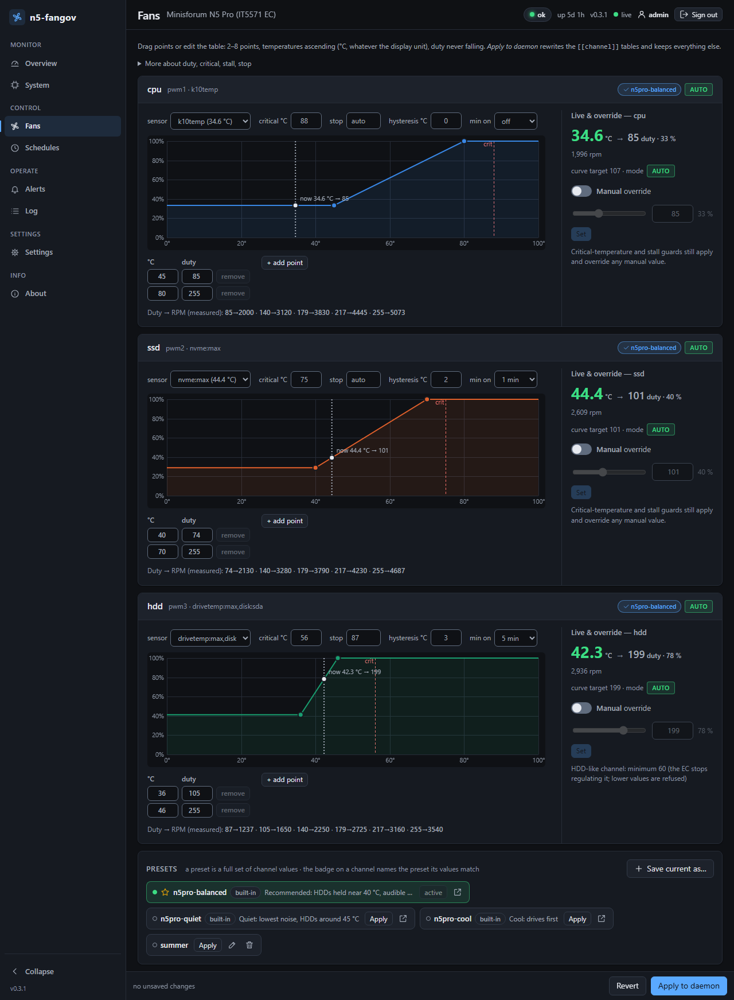

### Channel card

Header: channel name, `pwmN · sensor`, the **preset badge** and the mode badge. The
preset badge lists **every** preset whose values this channel runs — `✓ alternative ·
n5pro-balanced` when a user preset shares the channel with a built-in (user presets
first, in the order of the Presets row; the tooltip lists them one per line), `custom`
when no preset matches. The comparison is against what *Apply* of that preset would
produce, so a preset that sets no hysteresis/min on still matches a channel that has
them. The badge shows what the **daemon** runs, not the editor's unsaved values.

**Curve editor** (left): the fields *sensor* (the catalogue's ids with their live reading;
a channel configured with several sensors appears as one option `a,b (max of 2)` so the
editor never drops it — the array itself is edited in the file, [Sensor ids](06-configuration.md#sensor-ids)),
*critical °C*, *stop*, *hysteresis °C*, *min on*; the canvas with the curve, the dashed
`crit` line and the dotted `now` marker with `now 34.6 °C → 85`; the point table (`°C`,
`duty`, *remove* — disabled at two points); *+ add point* opens a row prefilled with the
middle of the widest temperature gap and the interpolated duty (*Add* / *Cancel*;
disabled at eight points). Drag the points on the canvas (touch works) or edit the table;
the table re-sorts by temperature when it loses focus. Temperatures are edited in °C
whatever the display unit. On the N5 Pro the measured *Duty → RPM* pairs sit under the
table.

**Live & override** (right): the current reading → the duty the channel runs (`34.6 °C →
85 duty · 33 %`), RPM, `curve target N · mode` — or `held N · mode` under an override —
and the mode badge; the **Manual override** switch; slider, number field and *Set*; a
note on the guards.

The switch is the override:

- Switching it **on** holds the duty the channel runs at that moment — `PUT
  /api/override/{name}` with the snapshot duty, raised to the HDD minimum where it
  applies — and the toast reads `hdd: manual — holding 199 (78 %)`. The slider and the
  number field are enabled; *Set* sends the value they show. Moving the slider alone
  changes nothing.
- Switching it **off** is `DELETE /api/override/{name}`: back to the curve. While the
  switch is off, slider, number and *Set* are disabled, not only dimmed.
- The daemon's snapshot follows one cycle later, so the switch shows the client's state
  for two regulation intervals after a change, then the daemon's `mode`. `CRITICAL` and
  `STALL` do not touch the switch: the override persists underneath and the switch still
  turns it off. Critical temperature and the stall guard override any manual value.
- **HDD-like channels** — a fixed `stop` duty, or pwm3 on the N5 Pro whatever its `stop`
  (the daemon's rule) — refuse values below 60: the slider starts there, *Set* is disabled
  below it, the note says why (the EC stops regulating them after the first write and a
  low manual duty would be permanent for disks whose temperature reacts minutes later).
  The daemon answers 400 to anything lower from any client.

The same from the shell: `n5-fangov set` / `auto` ([CLI](05-cli.md)).

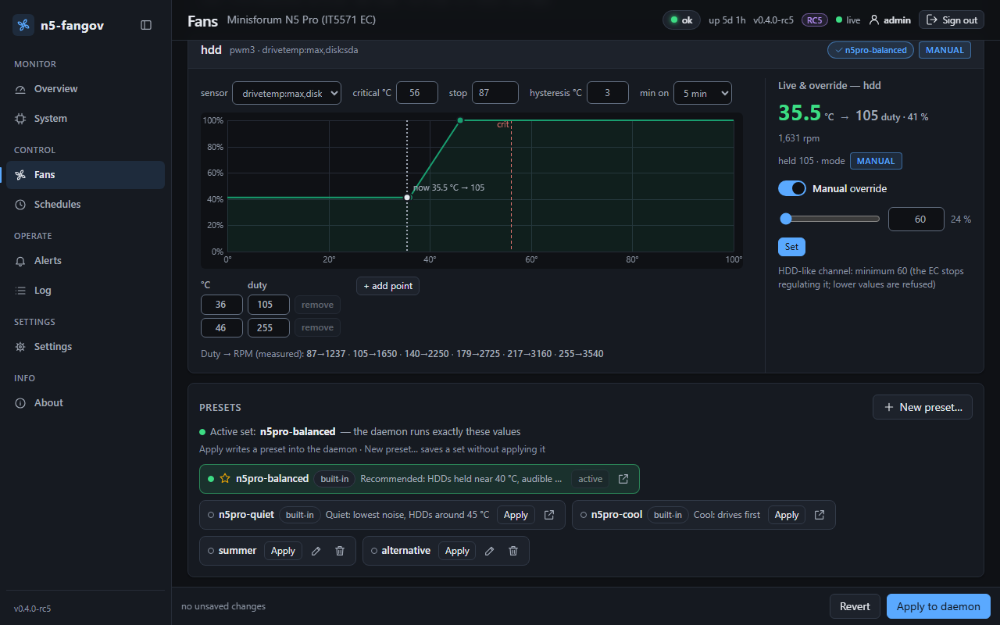

### Apply, Revert, validation

The action bar shows *no unsaved changes* or *unsaved changes* (the dot also sits on the
Fans entry of the sidebar and on the phone's channel selector), *Revert* and *Apply to
daemon*; while there are unsaved changes a third button **Save as preset…** appears left
of *Revert*. Edits persist across page switches without a prompt; *Sign out* asks before
discarding them, a session loss stashes them ([below](#connection-loss-and-session-expiry)),
the browser's own prompt covers a page close.

*Save as preset…* opens the [preset editor](#presets) filled with the edited curves and
*Start from* locked to *the editor (unsaved values)*. Saving stores the preset — the
curve editor keeps its unsaved changes and nothing is written to the daemon; the toast
says so (*Preset X saved — the editor still has unsaved changes; Apply to daemon writes
them*). This is the way to keep an experiment as a set before or without applying it.

*Apply to daemon* first checks what the daemon would replace by a default
([curve rules](06-configuration.md#curve-rules)) and sends nothing when a rule fails:

- 2..8 points; temperatures whole numbers −20..120 °C, strictly ascending; duties whole
  numbers 0..255, never falling;
- critical a whole number above the last point (at least last point + 1) and at most 150;
- stop `auto` (or empty) or a fixed duty 60..255;
- hysteresis 0..10; min on at most 1 h.

Errors are listed in a red notice (`role="alert"`) above the cards. When they pass, the
editor re-reads the config file (so a `[dashboard]`, `[alert]` or `[[schedule]]` change
made in the meantime is not overwritten), replaces the `[[channel]]` tables — sensor
(array form for a composite), curve, critical, stop, and hysteresis/min_on when set —
and writes with `PUT /api/config?strict=1`; everything else in the file stays
byte-identical. 200 reloads without a restart; a changed channel set answers 202 and the
notice *Written — restart required (channel set or profile changed): systemctl restart
n5-fangov* stays until *Revert*, the next apply, a page switch or a session change.
Warnings the daemon reports outside the channel tables are listed in the same notice.
*Revert* reloads the daemon's curves.

While the Fans page is open it re-reads config and presets every 30 s, so a preset applied
from another browser, the CLI or the scheduler shows up in the badges, the active set and
the Presets row within that time; a clean editor follows the daemon's curves, an editor
with unsaved changes keeps them.

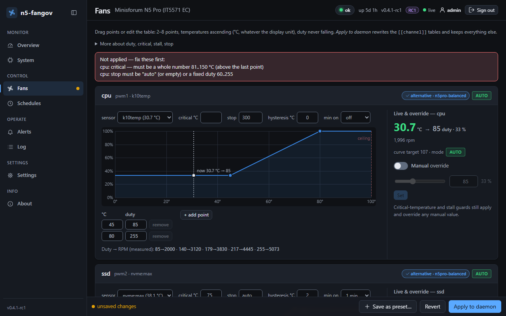
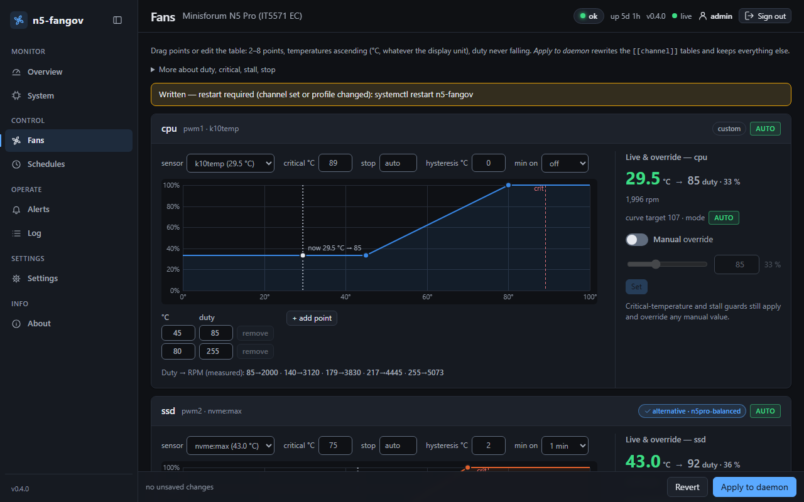

### Presets

The **Presets** card lists the built-in N5 Pro sets and the files in
`/etc/n5-fangov/presets/`. Its first line is the **active set**: *Active set:
n5pro-balanced — the daemon runs exactly these values* when every channel matches one
preset, *Active set: custom (matches no preset)* otherwise; when several presets match the
whole set they are all named. The line under the heading states the two directions:
*Apply writes a preset into the daemon · New preset… saves a set without applying it*. A
chip per preset with the active dot (● = the daemon runs exactly these values, compared
per pwm the way *Apply* merges), ★ *recommended*, the name, a *built-in* badge, the
description, *Apply* (`active` and disabled while it is active), an icon button
*Details* (built-in, opens the editor read-only) or *Edit* (user preset) and *Delete*
(user preset, with confirmation).

The rule behind badges and active set: **a channel can belong to several presets**, and
*Apply* switches only the channels whose values differ — a preset that shares the cpu
table with the running config leaves that table untouched (byte-identical in the file)
and rewrites the rest. So after applying a user preset that took two of its three
channels from `n5pro-balanced`, those two channels carry both names in their badge and
the active set names the user preset.

- *Apply* asks first (`The curves change immediately`; unsaved curve edits are discarded)
  and merges the preset into the config file by pwm — channels the preset does not name
  stay — and reloads; 202 shows a restart notice in the row. The values of the three
  built-in sets, the file format and the merge rule: [Presets](06-configuration.md#presets).
- *New preset…* opens the **preset editor** dialog. *Start from* chooses the values it
  is filled with: *the daemon (running curves)* — the default —, *the editor (unsaved
  values)* or any preset (from *Save as preset…* in the action bar it is fixed to the
  editor). Then the name (`a-z 0-9 _ -`, at most 64 characters; a
  built-in name is refused) and, per channel, critical / stop / hysteresis / min on and
  an editable point table with *add point* and remove — validated with the curve
  editor's rules. *Save preset* stores exactly the values shown (`PUT
  /api/presets/{name}` with the composed channels, [API](12-api.md#endpoints)); **nothing
  is applied** to the daemon. A name that exists asks before it is overwritten.
- *Edit* opens the same dialog for a user preset with *Start from* fixed; changing the
  name renames the file (saved under the old name first, then `POST …/rename`). *Details*
  of a built-in is the read-only form with *Close*. Escape, the backdrop and *Cancel* ask
  before unsaved edits in the dialog are dropped.
- A channel set that differs from the running config (names or pwms) is refused by the
  daemon — a preset is applied to this host.

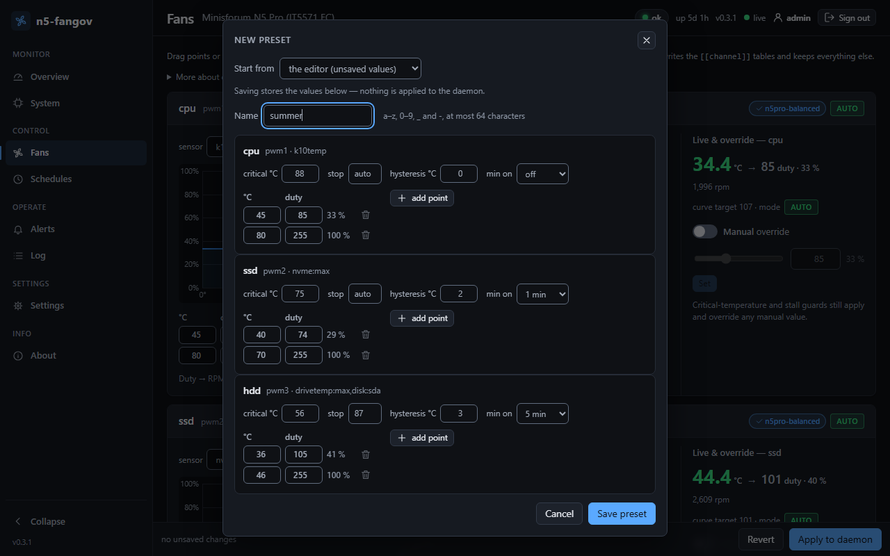

### Fans on a phone

Below 700 px a **channel selector** above the cards shows one channel at a time (a
breakpoint, not a setting); the dirty dot marks the entry of the edited channel. The
action bar sits above the bottom bar.

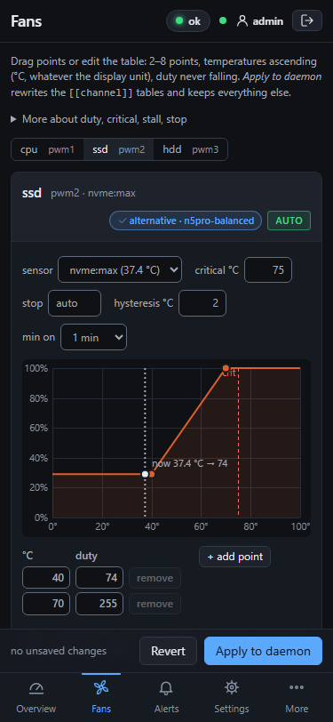

## Schedules

The `[[schedule]]` tables of the config as an editor plus a status card. One row per
entry: the **preset** select (the presets the daemon lists; a name the store lacks stays
selectable as `<name> (missing)` and is flagged *preset missing*; a fresh row reads
*— choose —*), **From** / **To** (time inputs; `to` before `from` crosses midnight), the
**days** as seven toggles Mo…Su (none pressed = *every day*), an `ACTIVE` mark on the
entry in effect, *make fallback* (turns the row into the entry without a window that is
active outside every window; disabled while another fallback exists) / *add window*, and
remove. *Add entry* appends a row (disabled without a scheduler or without presets — the
hint says to create one on the Fans page first); *Revert* reloads; *Save* is enabled
once something changed.

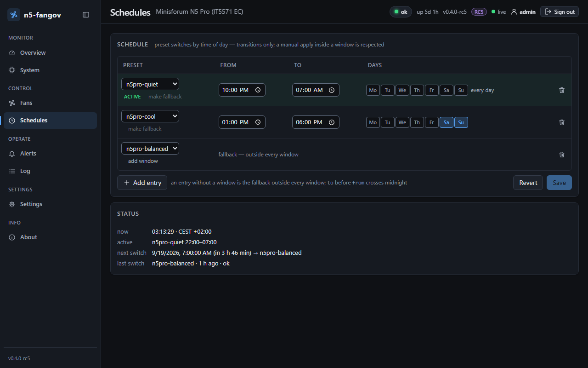

*Save* checks first — every entry has a preset, `from` and `to` are both set on a
windowed entry and differ, at most one fallback, at most 16 entries — and lists what
fails in a notice. Then it re-reads the config file, replaces the `[[schedule]]` tables
with the editor's (`from`/`to` only on a windowed entry, `days` only when not every day)
and writes `PUT /api/config?strict=1` — the same splice the Fans page uses for
`[[channel]]`, everything else stays. The daemon takes the list without a restart
(202 with its notice only when something else in the file needs one); warnings are
listed. Editing the file by hand writes the same tables ([Schedules](06-configuration.md#schedules)).

The **Status** card: **now** — the daemon's clock as `HH:MM:SS` in the host's zone,
followed by that zone (`14:03:22 · CEST +02:00`), ticking every second so a window can
be compared against the clock the scheduler uses; the time is derived from the `ts` of
the state snapshot (browser time plus the measured offset), the zone from
`GET /api/schedules`, and it reads `browser time` until the first snapshot has arrived
—, the active entry (`n5pro-balanced (fallback)` or the window; `none (outside every
window)` without a fallback), the next switch (absolute, `in …` and the preset; `no
preset (no fallback)` when leaving the last window applies nothing; `none within 8
days`), the last switch with the time and `ok` — or `failed: <reason>`, which also
appears as a warning notice. The card refreshes every 60 s while the page is open; a
dirty editor is never rebuilt by the refresh. Without a scheduler in this daemon the
card reads `unavailable (501)`.

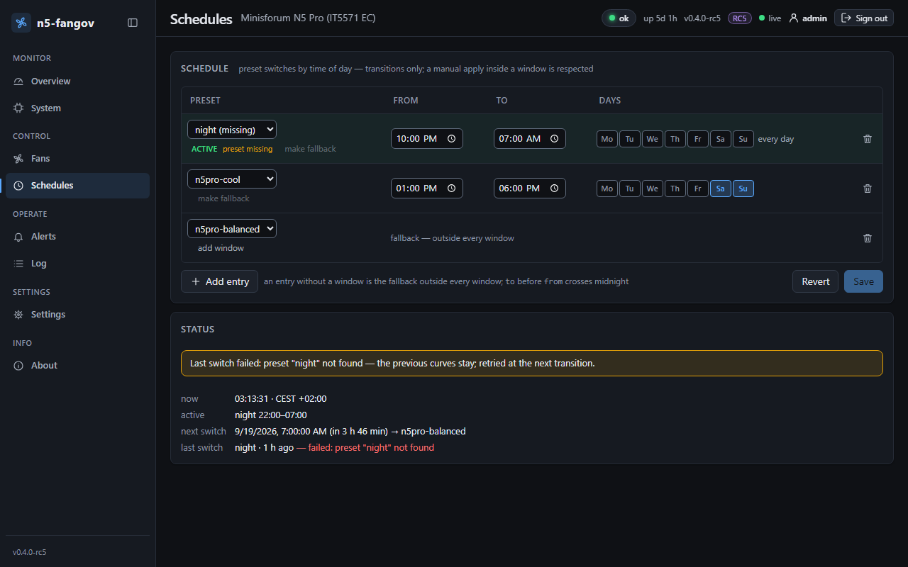

Leaving the page with unsaved edits asks (*Leave Schedules*); *Sign out* asks; a session
loss stashes the edits. From 1400 px editor and status sit side by side; below 700 px
every entry is a stacked block.

## Alerts

What the daemon delivers and did deliver; the transport itself is configured in
[Settings → Alert transport](#alert-transport). The **Delivery** card: effective
transport, `pve-notify` and `mail(1)` availability (with the install hint), the
configured webhook URL and format or `no URL configured`, the cooldown; *Configure*
leads to the Settings section; *Send test alert* sends kind `test` through the real
transport without cooldown and toasts `Test alert sent via <transport>` or the delivery
error (a second click while one runs: *Test alert already running*). **Recent alerts**:
the last 50 (kept across restarts), newest first, with `not delivered: …` in red. The
**kinds** table lists every alert kind with its description and the last delivery. What
each kind means, the webhook payload and the PVE side: [Alerts](07-alerts.md).

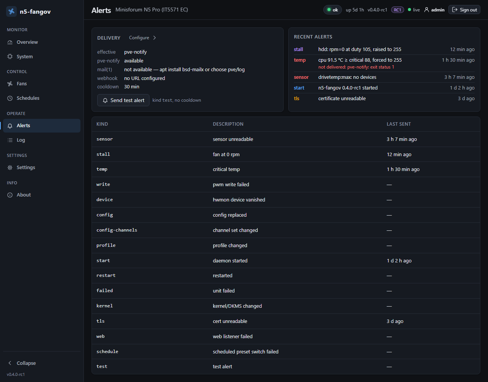
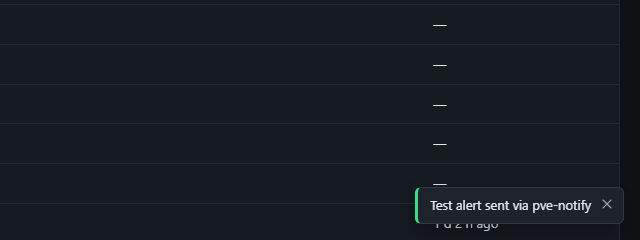

## Log

The daemon's log file (the journal when no file is configured) — the last 200 lines,
re-read every 10 s while the page is open: text *Filter* (`n of m match`), *auto-scroll*,
`source: file|journal`, *Refresh*, *Export* (the whole current file). WARN and ERROR lines
are coloured. *Clear log* lives in Settings → Danger zone (disabled with the journal as
source; rotated files and the journal stay). File, rotation and the CLI form:
[Logs](10-troubleshooting.md#logs).

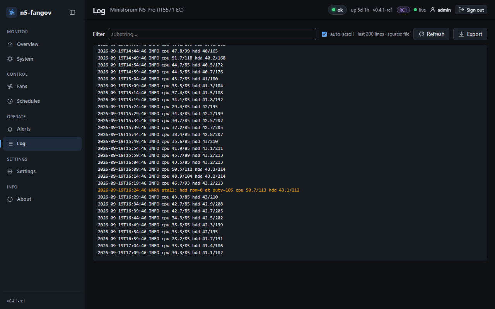

## Settings

One page, seven sections, a **sub-navigation** on the left (sticky from 900 px; chips
above the sections below that) that marks the section in view. Each section has a deep
link `#settings/<id>` ([Deep links](#deep-links)).

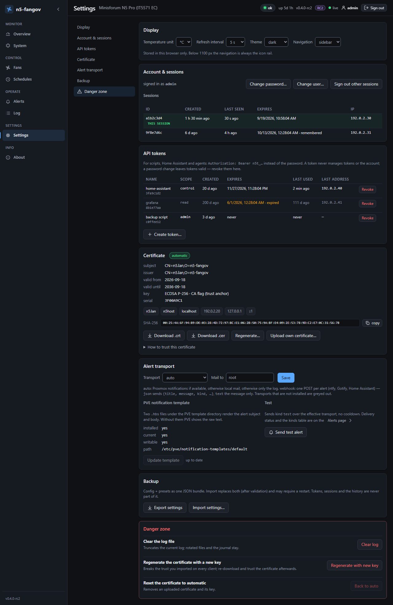

### Display

*Temperature unit* °C / °F (charts, tiles and sensors follow; the curve editor stays in
°C), *Refresh interval* 5 / 10 / 30 s (the `/api/state` poll), *Theme* system / dark /
light (default system), *Navigation* sidebar / icon rail (from 1100 px; the rail is forced
below). Stored in this browser only (`localStorage`, whitelisted values).

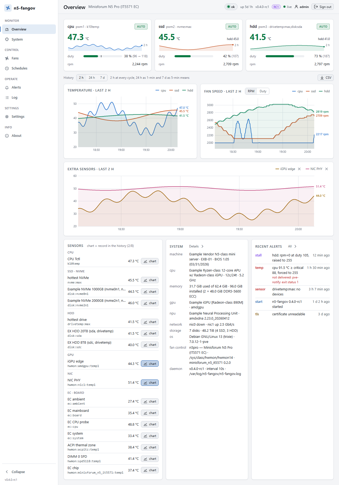

### Account & sessions

`signed in as <user>`, *Change password…*, *Change user…*, *Sign out other sessions*, and
the **Sessions** table (id, created, last seen, expires with `· remembered`, IP; the
current one is marked `THIS SESSION`).

- *Change password…* / *Change user…* ask for the current password, write the new
  `password_hash` (or `user`) into the config file in place — comments and every other
  key untouched — apply it at once and sign every *other* session out. User names are
  `[A-Za-z0-9_.-]{1,32}`, passwords 8..128 characters. A wrong current password counts as
  a failed login for the [rate limiter](08-https-security.md#login-throttling).
- The in-place edit handles the `[web]` header and the dotted `web.user = …` layout; an
  inline table `web = { … }` is refused with a message (edit the file by hand) — the same
  applies to `[alert]` and `[dashboard]`.
- `n5-fangov passwd` still works from the shell (restart to apply) — for a forgotten
  password, for instance ([Setup](03-setup.md#change-user-or-password-later)).
- With `auth = "none"` every visitor counts as signed in; the account forms answer
  `409 auth is none`.

Session lifetime, persistence and what *Sign out* can and cannot do:
[Sessions](08-https-security.md#sessions).

### API tokens

Shown to browser sessions and Basic auth only (a token can never manage tokens; with
`auth = "none"` the section is hidden — everyone is signed in and a Bearer header is
ignored). The table lists every token — name and id, scope, created, expires (`never`, or
marked `expired`), last used, last address — with *Revoke* (asks first; every client using
it stops at once). *Create token…* takes a name, the scope (`read`, `control`, `admin`,
each with a one-line explanation) and the expiry (`30 d · 90 d · 1 y · never`; *never*
shows a warning); after *Create* the secret is shown **once** in a read-only field with
*Copy* and the notice that it cannot be displayed again; *Done* hides it. What a token
can never do, where it is stored and how it is throttled:
[API tokens](08-https-security.md#api-tokens); using it: [API and integrations](12-api.md).

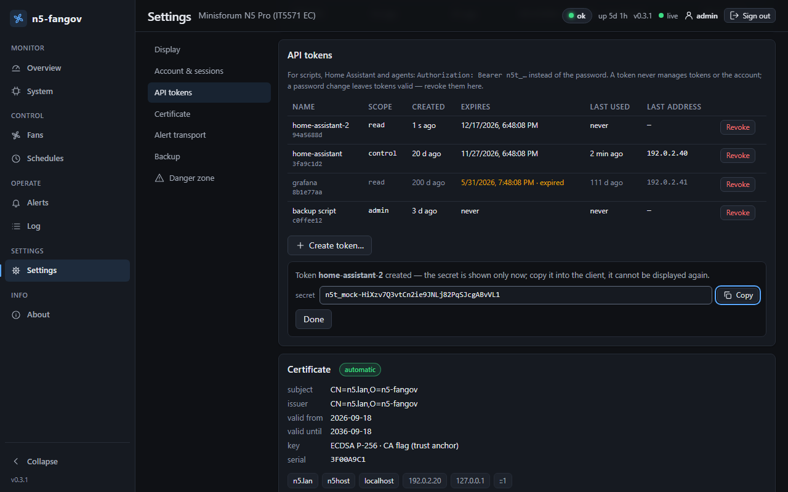

### Certificate

The badge reads *automatic*, *own certificate*, *automatic (fallback)* (warn) or *TLS
off*. With TLS off the section is one sentence (plain HTTP on loopback; how to get a
certificate). Otherwise: subject, issuer, valid from, valid until (`— in N days` below
30 days, `— expired`), key type with the CA flag, serial; the SAN chips; the SHA-256
fingerprint with *copy*; a notice with the server's warnings (a name this session uses
that the certificate does not cover; the fallback explanation); *Download .crt* (PEM:
Firefox, macOS, Linux), *Download .cer* (DER: Windows, Android), *Regenerate…* (a form
with *generate a new key (breaks imported trust)*; hidden in fallback and file mode),
*Upload own certificate…* (file inputs or PEM textareas for certificate and key; after a
400 with `force_required` the *install anyway* checkbox appears with the HSTS warning),
*Back to auto* (file mode and fallback only), and the collapsible **How to trust this
certificate** with the recipes for Windows, macOS, Firefox, Android and the Linux CLI.
What each action does: [HTTPS](08-https-security.md#the-certificate).

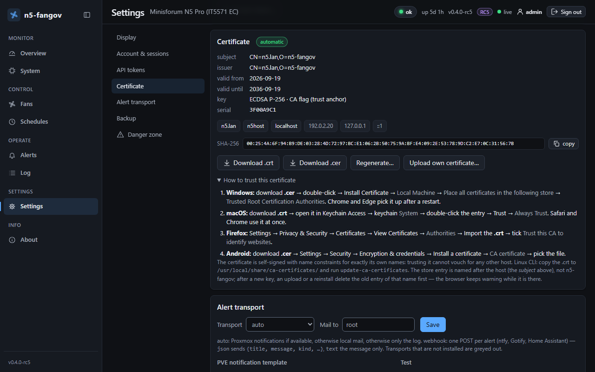
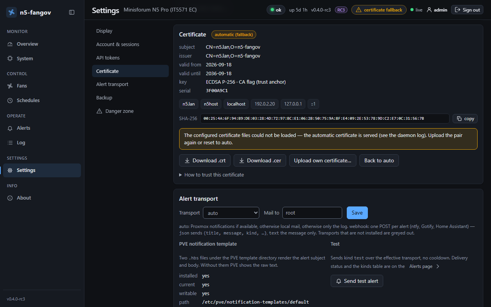
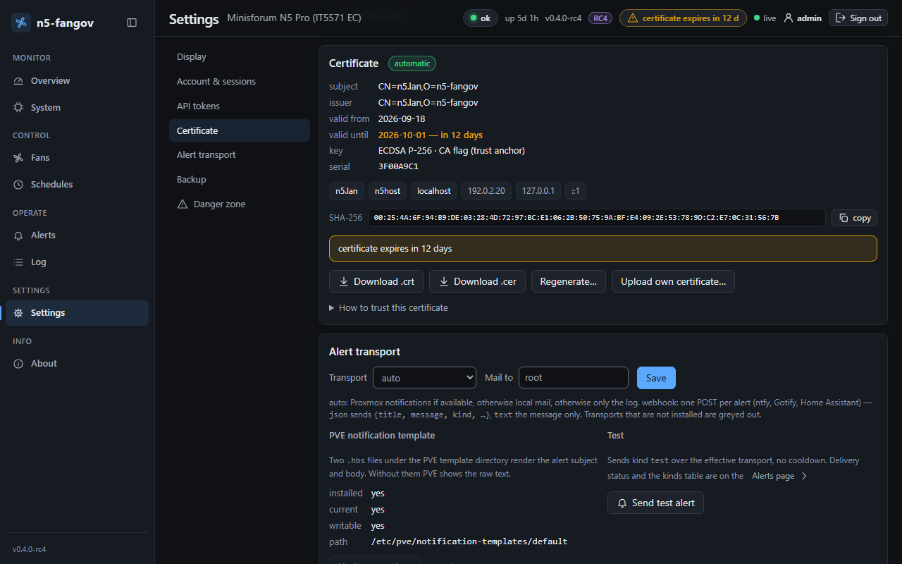
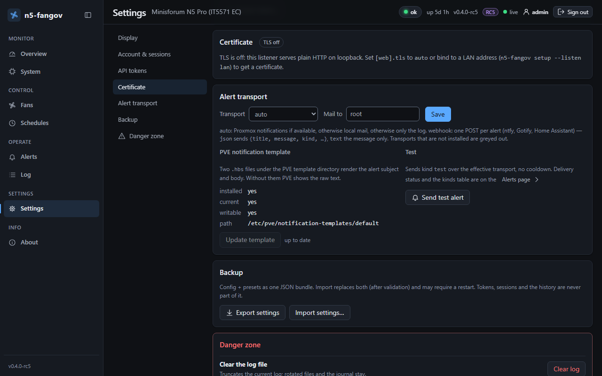

### Alert transport

The form: *Transport* (`auto`, `pve`, `mail`, `webhook`, `log`, `off`; transports the box
lacks are marked *(not available)* and disabled), *Mail to* for `auto`/`mail`, *URL* and
*Format* (`json` / `text`) for `webhook`, *Save* — written to the config file in place and
applied without a restart, the toast names the effective transport. Below: the **PVE
notification template** card (installed, current, writable, path; *Install template* /
*Update template*, disabled with the reason — shown only where PVE notifications are
available) and the **Test** card with *Send test alert* (the same as on the Alerts page)
and a link there. Payloads, transports and the PVE side: [Alerts](07-alerts.md).

### Backup

*Export settings* downloads config plus presets as one JSON bundle; *Import settings…*
replaces both after validation (asks first; 202 shows a restart notice below the header).
Tokens, sessions and the history are never part of it
([Backup and restore](09-updates.md#backup-and-restore)).

### Danger zone

*Clear log* (truncates the current log file; rotated files and the journal stay; disabled
with the journal as source), *Regenerate with new key* (asks; breaks the trust imported on
every client), *Back to auto* (asks; removes an uploaded certificate and its key). The two
certificate buttons are enabled only where they apply.

## About

Public: name, version with the pre-release badge, a description, licence, repository,
author, the releases page, *built with* (the Go version; signed in only) and the credits:
[`ltdstudio/minisforum-n5-it5571`](https://github.com/ltdstudio/minisforum-n5-it5571)
(the kernel driver for the IT5571 EC) and
[`Sl0thC0der/proxfansx`](https://github.com/Sl0thC0der/proxfansx) (the dashboard idea
and the generic NCT67xx/IT87xx handling the `nct67xx`/`it87xx` profiles follow; no code
shared). In mock mode a hint lists the mock flags. Signed in, the **Compatibility** card
below lists the profiles this build knows — name with `ACTIVE`, title, *verified on
hardware* / *from documentation · untested*, notes; deep link `#about/compat`.

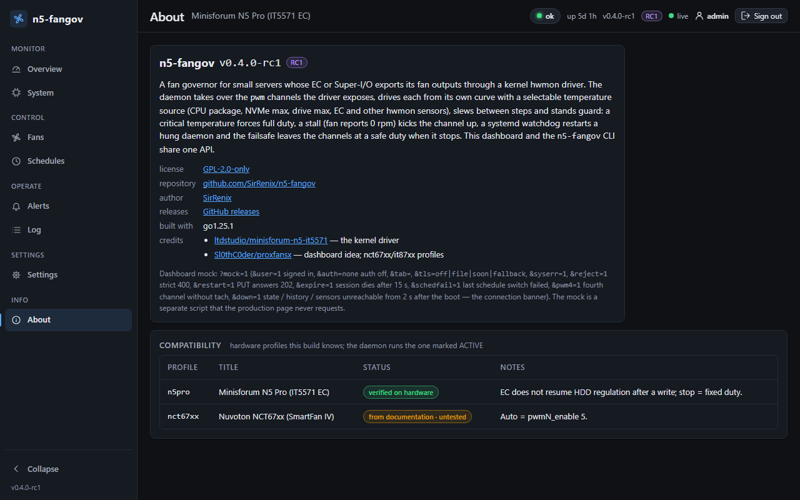

## Dialogs

- **Sign in** — *User*, *Password*, *Remember me* (30 days on this browser, else 12 h),
  an inline error (`invalid user or password`, `too many attempts`) and the recovery hint
  *Forgot the password? On the host, as root: `n5-fangov passwd`* — root on the box is
  the only recovery path, by design.
- **Confirm** — replaces the browser's dialogs: title, text, *Cancel* and the action
  (*Apply*, *Delete*, *Revoke*, *Sign out*, …; a destructive one is red and the focus
  starts on *Cancel*). Escape and the backdrop answer *no*.
- **Preset editor** — [above](#presets).
- **More** — the phone's page sheet.

## Keyboard and screen readers

- *Skip to content* is the first focusable element; it jumps to the page content.
- The sidebar and the bottom bar are `nav` elements with a `button` per page in a list
  labelled by its group; the current page carries `aria-current="page"`. A page switch by
  the user moves the focus to the page heading (or the section a deep link names).
- Every curve point is focusable (`role="slider"`, value text `45 °C → duty 85 (33 %)`);
  the arrow keys move it by 1 °C / 5 duty, Shift × 5, within its neighbours.
- The override is a `role="switch"` with `aria-checked`; while a change is in flight it
  is `aria-busy`, never disabled, so the focus stays.
- Day toggles, the *chart* toggles and the range/metric switches carry `aria-pressed`.
- Validation notices are `role="alert"`; the status chip is `role="status"` and is
  rewritten only when the text changes; toasts use a polite region, errors an assertive
  one.
- Icon-only controls carry `aria-label`; icons next to text are hidden from assistive
  technology. Every table has column headers; the sessions table names the current
  session in text.

## Theme and motion

Dark by default when the system reports no preference; *Theme* in Settings → Display
switches to dark, light or system. Colours, spacing, radii and the type scale are tokens
in `app.css`. The green live dot pulses unless the browser reports
*prefers-reduced-motion* — Windows: *Accessibility → Visual effects → Animation effects*
off, or the energy-saver mode —; the same preference stops the duty-bar and switch
transitions and the toast animation.

## Deep links

`#overview`, `#system`, `#fans`, `#schedules`, `#alerts`, `#log`, `#settings`, `#about`;
`#settings/<section>` scrolls to a section — `st-display`, `st-account`, `st-tokens`,
`st-cert`, `st-alerts`, `st-backup`, `st-danger` (the certificate chip in the header
opens `#settings/st-cert`); `#about/compat`. A page that needs a login, or an unknown
hash, falls back to the Overview; Back and Forward follow the hash. In mock mode the
0.3 parameter `?tab=` is still accepted once and maps `curves`, `manual`, `presets` to
`fans` and `compat` to `about` (the screenshot script uses it).

## The mock

`index.html?mock=1` renders the dashboard against `mock.js` — a separate script the
production page never requests — with documentation values (`n5host`, `192.0.2.x`,
`n5.lan`; login `admin`/`admin`). Flags:

| Flag | Effect |
|---|---|
| `&user=1` | signed in |
| `&auth=none` | `auth = "none"`: everyone signed in, no user, no Sign in/out |
| `&tls=off\|file\|soon\|fallback` | certificate states: TLS off on loopback, own certificate, expiring in 12 days, fallback to the automatic one |
| `&tab=curves\|manual\|presets\|compat\|<page>` | the 0.3 parameter, mapped to the page ([Deep links](#deep-links)) |
| `&syserr=1` | System: source notice for a missing `lspci` |
| `&reject=1` | `PUT /api/config?strict=1` answers 400 |
| `&restart=1` | `PUT /api/config` answers 202 (restart notice) |
| `&expire=1` | the session dies 15 s after the boot (session-expiry path) |
| `&schedfail=1` | the last schedule switch failed; the first entry names a preset the store lacks |
| `&pwm4=1` | a fourth channel `pcie` (pwm 4, no tachometer) |
| `&lag=1` | an override PUT/DELETE shows in `/api/state` only two polls later — the daemon's next-cycle lag |
| `&down=1` | state, history and sensors unreachable from 2 s after the boot — the connection banner |

The mock implements every endpoint of the API, including tokens (`n5t_mock…`),
schedules, the history tiers, CSV, the webhook status, `disk:*` sensors and the preset
body; it validates curves, stop and min on with the daemon's rules. Its presets are the
three built-ins, `summer` and `alternative` (cpu and ssd taken from `n5pro-balanced`, its
own hdd curve — the case behind the multi-name badge). Regenerating the screenshots:
[screenshots/README.md](screenshots/README.md); the Fans control paths:
[fans-matrix.mjs](11-development.md#fans-scenario-matrix).

## Connection loss and session expiry

- **Connection loss** — after two consecutive failed polls (network error or a 5xx) the
  banner *Connection to the daemon lost — retrying. Fans keep running on the daemon
  side.* appears and the live dot turns red; polling continues and the banner goes with
  the next answer. The fans are the daemon's business (failsafe on exit), see
  [Troubleshooting](10-troubleshooting.md).
- **Session expiry** — a 401 on a protected call while signed in means the session is
  gone (12 h, 30 d with *Remember me*, or the password was changed outside the
  dashboard). The page returns to the anonymous Overview, protected content leaves the
  DOM, and the toast reads *Session expired — sign in again*, with *— curve edits kept*
  and *— schedule edits kept* when there were unsaved edits on the Fans or Schedules
  page. Those edits are stashed: after the next sign-in they are restored with a notice
  on the page (*Unsaved curve edits from before the session expired are restored — apply
  or revert*; the same for schedules) and a toast when another page is open.
- *Sign out* with unsaved curve or schedule edits asks first; closing the browser tab
  with unsaved edits triggers the browser's own prompt.

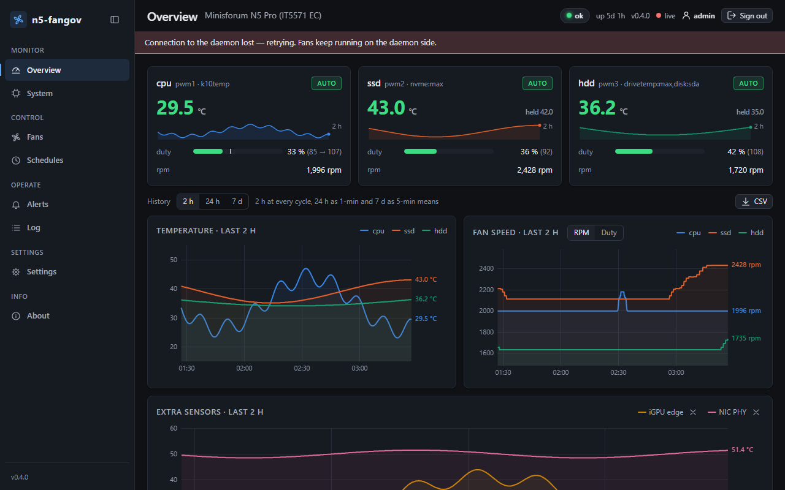

## On a phone

Below 700 px: bottom bar and *More* sheet instead of the sidebar, one-line header, tiles
and cards stacked, the Fans page with its channel selector, schedule entries as stacked
blocks, settings sub-navigation as chips; curve points drag by touch.

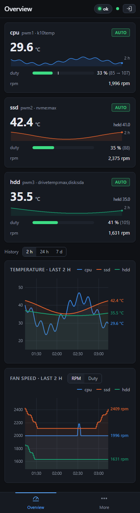
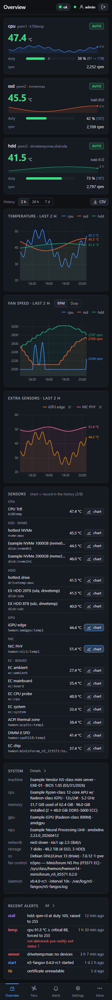
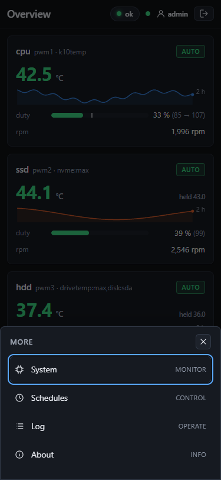

Next: [CLI reference](05-cli.md) · [Configuration](06-configuration.md) ·
[API and integrations](12-api.md) · [HTTPS and security](08-https-security.md)
