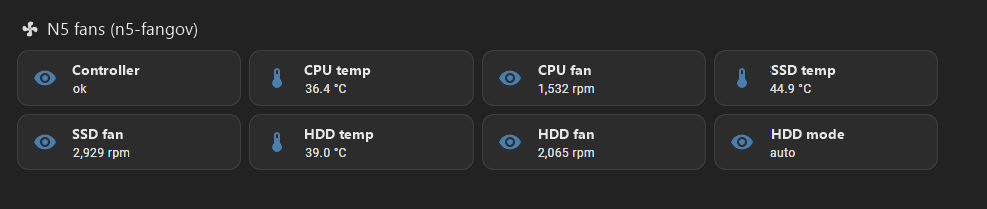

# API and integrations

How a script, Home Assistant or an agent talks to the daemon. Request and response
bodies are in the OpenAPI document the daemon serves, not here.

## Reaching the API

Base URL = the dashboard's address: `http://127.0.0.1:8010` (scope `local`) or
`https://n5host:8010` (`lan`, [Setup](03-setup.md)). Everything is under `/api/`;
answers are JSON, errors `{"error": "…"}` (plus `"errors": [...]` where a list
exists). The `Host` header must be an IP literal, `localhost`, the listen host or an
`allowed_hosts` entry; any other name gets 421
([Host header](08-https-security.md#host-header-and-csrf)).

The automatic certificate is self-signed. Either trust it on the client
(`n5-fangov cert export n5host.crt`, then `curl --cacert n5host.crt …`;
[The certificate](08-https-security.md#the-certificate)) or skip verification
(`curl -k`, `verify_ssl: false`) on a LAN you trust.

The CLI does not use this port; it talks over the root-only unix socket without
credentials ([The socket](05-cli.md#the-socket)).

## Authentication

With `auth = "none"` (loopback default) nothing is needed. With `auth = "basic"` there
are three ways:

| Caller | Sends | For |
|---|---|---|
| Browser session | cookie `n5fangov_session` + header `X-N5-Fangov-Csrf: 1` on writes | the dashboard |
| Basic auth | `Authorization: Basic …` (`curl -u admin`) + `X-N5-Fangov-Csrf: 1` on writes | one-off shell commands with the admin password |
| **API token** | `Authorization: Bearer n5t_...` — **no CSRF header** | scripts, Home Assistant, monitoring, agents |

Use an API token for anything that runs unattended. Create one in the dashboard
(Settings → *API tokens*) or with
`n5-fangov token create NAME --scope read|control|admin [--ttl DAYS]`; the secret is
shown once. Storage, expiry, revocation, rate limit and what a token can never do:
[API tokens](08-https-security.md#api-tokens).

In the examples `n5t_...` stands for the whole secret as `token create` printed it;
`Authorization: Bearer <token>` sent literally is a 401. `GET /api/session` with the
token answers `"via": "bearer"` and the scope, the quickest proof that the header
arrived intact.

```
# read: the full snapshot (anonymous callers get the reduced one)
curl -H "Authorization: Bearer n5t_..." https://n5host:8010/api/state
curl -H "Authorization: Bearer n5t_..." https://n5host:8010/api/session     # {"authenticated":true,"via":"bearer","scope":"read",…}

# control: manual override and back to the curve — no CSRF header for a token
curl -X PUT -H "Authorization: Bearer n5t_..." -H "Content-Type: application/json" \
     -d '{"duty":180}' https://n5host:8010/api/override/hdd
curl -X DELETE -H "Authorization: Bearer n5t_..." https://n5host:8010/api/override/hdd

# control: apply a preset
curl -X POST -H "Authorization: Bearer n5t_..." https://n5host:8010/api/presets/n5pro-quiet/apply

# the same with Basic auth needs the CSRF header
curl -u admin -X POST -H "X-N5-Fangov-Csrf: 1" https://n5host:8010/api/presets/n5pro-quiet/apply
```

Answers to expect: 401 (no or rejected credentials, an expired or revoked token
included), 403 (scope, or a token on a session-only endpoint), 421 (Host), 429 (login
throttling or the per-token rate limit `{"error":"token rate limit"}`), 202 on a config
write that needs a restart. A rejected token counts like a wrong password
([Login throttling](08-https-security.md#login-throttling)).

## Scopes

Cumulative; `read` is the default when a token is created.

| Scope | Allows |
|---|---|
| `read` | `GET` on `version`, `about`, `session`, `openapi.json`, `state`, `history`, `history.csv`, `system`, `sensors`, `profiles`, `presets`, `presets/{name}`, `alerts`, `dashboard`, `schedules`, `tls` (info only, not the certificate downloads) |
| `control` | `read` + `PUT`/`DELETE /api/override/{name}`, `POST /api/presets/{name}/apply`, `PUT /api/dashboard` |
| `admin` | everything the dashboard can do **except** token and account management |

No token, `admin` included, can reach `/api/tokens*`, `/api/account/*`, `/api/login` or
`/api/logout` (403): tokens are created, listed and revoked by a browser session or
Basic auth only. Out of scope: 403
`{"error":"token scope read does not allow PUT /api/override/cpu","scope":"read","required":"control"}`.

## OpenAPI

`GET /api/openapi.json` (public) is an OpenAPI 3.1 document rendered from the daemon's
route table, so it cannot drift from the server. It carries `info.version`, the
security schemes `bearer`, `basic` and `cookie`, and per operation the summary,
parameters, request body schema, response codes, `x-scope`
(`read`/`control`/`admin`/session-only) and `x-class` (`public`, `filtered`,
`protected`). Feed it to a generator, an API client or an agent:

```
curl -s https://n5host:8010/api/openapi.json | jq '.paths | keys'
```

## Endpoints

Method, path, scope and purpose; bodies and response shapes are in the OpenAPI
document. *Class* `public` needs no credentials, `filtered` answers anonymous callers
with a reduced document, `protected` needs credentials. *session* = browser session or
Basic auth only, never a token.

**No credentials**

| Method | Path | Class | Purpose |
|---|---|---|---|
| `GET` | `/api/version` | public | name, version, `prerelease`, `tls`, `auth`, the UI's validation `limits` |
| `GET` | `/api/about` | public | licence, repository, author, credits |
| `GET` | `/api/session` | public | who the caller is: `authenticated`, `mode`, `user`, `via` (`cookie`/`basic`/`bearer`/`none`), `scope` and `token_id` for a token |
| `GET` | `/api/openapi.json` | public | the OpenAPI document |
| `GET` | `/api/state` | filtered | snapshot: status, channels (temperature, duty, target, RPM, mode; signed in also `held_temp`, `hold_until`, `ceiling`, `ceiling_hit`, EC and watched temperatures, alert stamps) |
| `GET` | `/api/history` | filtered | history points (`minutes`, `since`; anonymous: without `extra`) |

**Scope `read`**

| Method | Path | Purpose |
|---|---|---|
| `GET` | `/api/history.csv` | the same points as CSV attachment (`minutes`) |
| `GET` | `/api/system` | hardware inventory with live disk temperatures |
| `GET` | `/api/sensors` | sensor catalogue with live readings and `kind` |
| `GET` | `/api/profiles` | profiles with the active one |
| `GET` | `/api/presets`, `/api/presets/{name}` | preset list, one preset's channel tables |
| `GET` | `/api/schedules` | `[[schedule]]` entries, active, next and last switch, timezone (501 without a scheduler) |
| `GET` | `/api/alerts` | transport status (`webhook_url` full for a session or Basic auth, query and userinfo redacted for a token caller), kinds with last delivery, recent alerts |
| `GET` | `/api/dashboard` | the watched sensor ids |
| `GET` | `/api/tls` | certificate mode, info, warnings, fallback flag |

**Scope `control`**

| Method | Path | Purpose |
|---|---|---|
| `PUT` | `/api/override/{name}` | manual duty (`{duty}` or `{percent}`; HDD-like channels ≥ 60) |
| `DELETE` | `/api/override/{name}` | back to the curve |
| `POST` | `/api/presets/{name}/apply` | apply a preset (merge by pwm; 202 when a restart is needed) |
| `PUT` | `/api/dashboard` | set the watched sensor ids |

**Scope `admin`**

| Method | Path | Purpose |
|---|---|---|
| `GET` | `/api/config` | raw TOML and the parsed config (hash redacted) |
| `PUT` | `/api/config[?strict=1]` | write the config file and reload (200 / 202 / 400) |
| `GET` | `/api/config/export` | settings bundle (config + presets, never tokens) |
| `POST` | `/api/config/import` | restore a bundle |
| `PUT` | `/api/presets/{name}` | save a preset: the running channel tables (empty body) or the channels of the JSON body ([below](#saving-a-preset-with-a-body)) |
| `POST` | `/api/presets/{name}/rename` | rename a user preset |
| `DELETE` | `/api/presets/{name}` | delete a user preset |
| `PUT` | `/api/alerts` | transport, `mail_to`, `webhook_url`, `webhook_format` |
| `POST` | `/api/alerts/test` | send a test alert through the real transport |
| `POST` | `/api/alerts/template` | install the PVE notification template |
| `GET` | `/api/log`, `/api/log/export` | log lines (`lines`), the whole current file |
| `DELETE` | `/api/log` | truncate the log file |
| `GET` | `/api/tls/cert.crt`, `/api/tls/cert.cer` | certificate download (PEM / DER) |
| `POST` | `/api/tls/regenerate`, `/api/tls/upload`, `/api/tls/reset` | certificate actions (409 with `tls = "off"`) |

**Session only** (403 for every token)

| Method | Path | Purpose |
|---|---|---|
| `POST` | `/api/login`, `/api/logout` | cookie session |
| `GET` | `/api/tokens` | token list (never the secrets) |
| `POST` | `/api/tokens` | create a token (`name`, `scope`, `ttl_days`; 201 with the secret once) |
| `DELETE` | `/api/tokens/{id}` | revoke |
| `GET` | `/api/account` | user, mode, sessions |
| `POST` | `/api/account/password`, `/api/account/user`, `/api/account/sessions/revoke` | credentials and sessions |

Body limits: 256 KiB config/import and preset body, 64 KiB certificate upload, 4 KiB
for override, login, account and token JSON (413 above). Every state-changing request
from a cookie or Basic caller needs `X-N5-Fangov-Csrf: 1`.

### Saving a preset with a body

`PUT /api/presets/{name}` (scope `admin`) with an **empty body** stores the `[[channel]]`
tables the daemon runs. With a JSON body it stores the channels of the body instead,
the preset editor's path. **Nothing is applied** to the daemon either way:

```json
{"channels": [
  {"name": "cpu", "pwm": 1, "sensor": "k10temp", "curve": [[45, 85], [80, 255]], "critical": 88, "stop": "auto"},
  {"name": "ssd", "pwm": 2, "sensor": "nvme:max", "curve": [[40, 74], [70, 255]], "critical": 75, "stop": "auto", "hysteresis": 2, "min_on": "1m"},
  {"name": "hdd", "pwm": 3, "sensor": "drivetemp:max,disk:sda", "curve": [[36, 105], [46, 255]], "critical": 56, "stop": "87", "hysteresis": 3, "min_on": "5m"}
]}
```

Schema `PresetSave`: `channels[]` (at least one) of `name`, `pwm`, `sensor` (several
ids joined by `,`), `curve` (`[temp_c, duty]` pairs) and `critical` (required), `stop`
(`auto`, empty = `auto`, or a fixed duty `60..255` as a string), `hysteresis`
(`0..10`), `min_on` (Go duration, `0s` = off). Unknown keys, a point that is not
exactly two values, and anything after the JSON object are 400. The body is parsed with
the config's own [curve rules](06-configuration.md#curve-rules); every warning the
lenient parser would replace by a default is an error here: `400 {"error": "preset
rejected", "errors": […]}`. The channel set must be the running config's (`name@pwmN`
per channel): 400 otherwise. A built-in name is 409, a body above 256 KiB 413, a write
failure 500, no preset store 501. 200 `{"ok": true, "saved": "<name>"}`.

```
curl -u admin -H "X-N5-Fangov-Csrf: 1" -H "Content-Type: application/json" \
  -X PUT --data @summer.json https://n5host:8010/api/presets/summer
```

## History and CSV

`GET /api/history?minutes=N&since=TS` returns `[{ts, temp{}, duty{}, rpm{}, extra{}}]`:
maps by channel name, `extra` by watched sensor id (omitted when empty; anonymous
callers never get it). `minutes` is 1..10080 (7 days; default 120) and selects the
tier: up to 2 h one point per cycle, up to 24 h one-minute means, above that
five-minute means. `since` (unix seconds) returns only newer points; the dashboard's
2 h view polls this way every 30 s. Points are kept across restarts in
`/var/lib/n5-fangov/history.json`, saved every 10 minutes and at stop
([Overview](04-dashboard.md#overview)).

`GET /api/history.csv?minutes=N` (scope `read`) is the same as an attachment
`n5-fangov-history-<host>-<YYYYMMDD-HHMMSS>.csv` (host local time): header
`ts,time,<ch>_temp,<ch>_duty,<ch>_rpm,…` followed by one column per watched sensor id
(channels in daemon order, then the ids sorted); `time` is RFC 3339 in the host's local
time, an absent value is an empty cell.

```
curl -H "Authorization: Bearer n5t_..." -o week.csv "https://n5host:8010/api/history.csv?minutes=10080"
```

## Home Assistant

Two files hold the complete recipe with documentation values:
[`openapi/home-assistant-rest.yaml`](openapi/home-assistant-rest.yaml) (sensors and the
preset command) and [`openapi/home-assistant-automation.yaml`](openapi/home-assistant-automation.yaml)
(automations). Put the token into `secrets.yaml` as
`n5_fangov_token: "Bearer n5t_..."`: a `control` token when the preset command is used.
The sensors alone need `read` or no token at all, because the reduced `/api/state`
already carries temperature, RPM and mode per channel.

**Sensors** — one `rest` resource polls `/api/state` every 30 s; each sensor picks its
channel by name from `channels[]`:

```yaml
rest:
  - resource: https://n5host:8010/api/state
    scan_interval: 30
    verify_ssl: false
    headers:
      Authorization: !secret n5_fangov_token
    sensor:
      - name: "N5 fan cpu temperature"
        unique_id: n5_fangov_cpu_temp
        value_template: "{{ (value_json.channels | selectattr('name', 'eq', 'cpu') | first).temp }}"
        unit_of_measurement: "°C"
        device_class: temperature
        state_class: measurement
      - name: "N5 fan cpu rpm"
        unique_id: n5_fangov_cpu_rpm
        value_template: "{{ (value_json.channels | selectattr('name', 'eq', 'cpu') | first).rpm }}"
        unit_of_measurement: "rpm"
        state_class: measurement
      - name: "N5 fan cpu mode"
        unique_id: n5_fangov_cpu_mode
        value_template: "{{ (value_json.channels | selectattr('name', 'eq', 'cpu') | first).mode }}"
```

Repeat the three sensors per channel (`ssd`, `hdd`, …). `rpm` is −1 on a channel
without a tachometer, `temp` −999 while the sensor is unknown; filter those in a
template if they should not reach the history.

**On a dashboard** — a *sections* view with one `tile` card per sensor (the package form
of the sensors above lives in `/config/packages/n5_fangov.yaml`, the card block in the
dashboard YAML or the UI editor):



```yaml
- type: grid
  column_span: 2
  cards:
    - type: heading
      heading: N5 fans (n5-fangov)
      icon: mdi:fan
    - { type: tile, entity: sensor.n5_fan_controller_status, name: Controller }
    - { type: tile, entity: sensor.n5_fan_cpu_temperature, name: CPU temp }
    - { type: tile, entity: sensor.n5_fan_cpu_rpm, name: CPU fan }
    - { type: tile, entity: sensor.n5_fan_ssd_temperature, name: SSD temp }
    - { type: tile, entity: sensor.n5_fan_ssd_rpm, name: SSD fan }
    - { type: tile, entity: sensor.n5_fan_hdd_temperature, name: HDD temp }
    - { type: tile, entity: sensor.n5_fan_hdd_rpm, name: HDD fan }
    - { type: tile, entity: sensor.n5_fan_hdd_mode, name: HDD mode }
```

A `rest:` block that is new to the installation needs one Home Assistant Core restart;
afterwards *Developer tools → YAML → REST entities and services* (`rest.reload`) picks
up changes. The controller status sensor (`value_json.status`) is a cheap liveness
check for an automation.

**Preset command** — a `rest_command` that applies a preset by name; needs a `control`
token. A Bearer caller sends **no** `X-N5-Fangov-Csrf` header.

```yaml
rest_command:
  n5_fangov_apply_preset:
    url: "https://n5host:8010/api/presets/{{ preset }}/apply"
    method: POST
    verify_ssl: false
    headers:
      Authorization: !secret n5_fangov_token
```

**Automation** — a plain time-of-day switch belongs into `[[schedule]]` on the box
([Schedules](06-configuration.md#schedules)); the automation is for triggers only Home
Assistant knows about:

```yaml
automation:
  - alias: "N5 fans: quiet while the media room is in use"
    triggers:
      - trigger: state
        entity_id: input_boolean.media_room_in_use
    actions:
      - action: rest_command.n5_fangov_apply_preset
        data:
          preset: "{{ 'n5pro-quiet' if trigger.to_state.state == 'on' else 'n5pro-balanced' }}"
```

**`verify_ssl: false`** skips the check of the self-signed certificate: acceptable on
a LAN you trust, and the only option on Home Assistant OS, where the container's CA
store is not yours to extend. On a Core or Container install trust the certificate
instead (`n5-fangov cert export`, then the Linux recipe in
[The certificate](08-https-security.md#the-certificate)) and drop the flag. The flag
is also unnecessary when the box serves a certificate from a CA Home Assistant already
trusts (`tls = "file"`).

Alerts in the other direction, the daemon pushing to a Home Assistant webhook:
[Webhook](07-alerts.md#webhook).

## Other clients

- **Monitoring** — poll `/api/state` with a `read` token; `status` is `starting` (first
  cycle not done yet), `ok`, `sensor-error`, `write-error` or `dry-run`. A channel
  `mode` other than `auto`/`manual` is worth an alarm. `/api/system` adds per-disk
  temperatures.
- **Agents** — hand them `/api/openapi.json` and a token with the smallest scope that
  does the job; `control` lets an agent apply presets and set overrides, never edit
  curves or credentials.
- **Shell on the box itself** — `n5-fangov status|set|auto|…` over the socket needs no
  token ([CLI](05-cli.md)).
